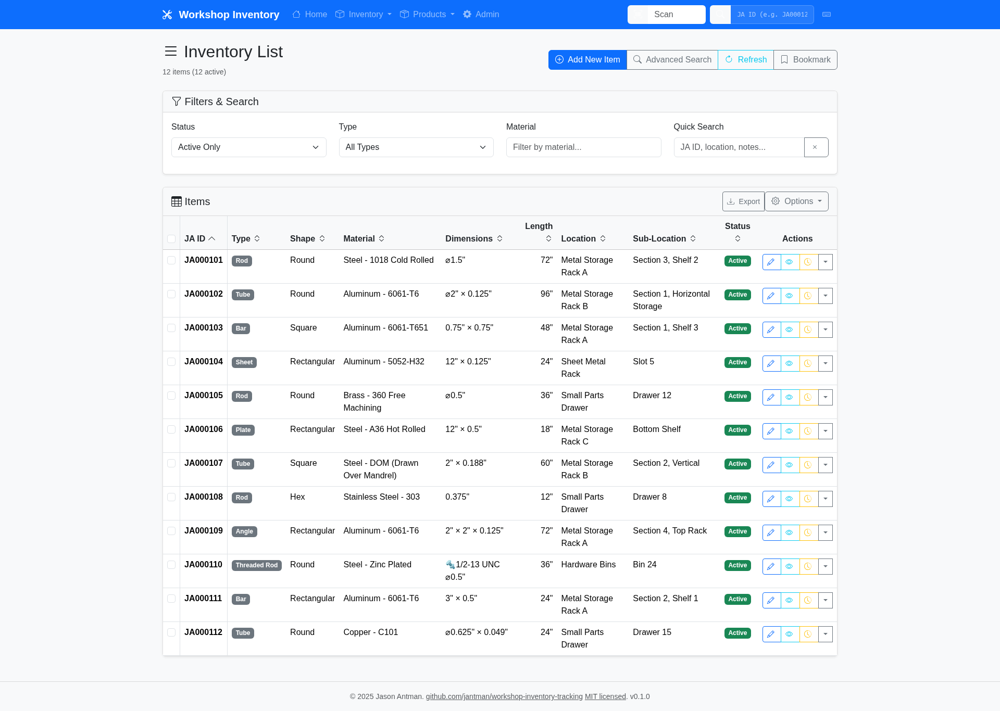

# Workshop Inventory Tracking

[](https://github.com/jantman/workshop-inventory-tracking/actions/workflows/test.yml)
[](https://github.com/jantman/workshop-inventory-tracking/actions/workflows/security.yml)
[](https://github.com/jantman/workshop-inventory-tracking/actions/workflows/release.yml)

A ⚠️☠️🚨 **vibe-coded**, authored by Claude, and minimally reviewed ⚠️☠️🚨 Flask web application for comprehensive workshop materials inventory management with dual storage backend support (Google Sheets/MariaDB), advanced search capabilities, and professional user experience features.

## Features


*Main inventory list interface showing materials with search, filtering, and batch operations*

- **Complete Inventory Management**: Add, move, shorten, and track materials with parent-child relationships
- **Product Catalog**: Catalog what you buy -- what a part is, what it cost, and where it came from. Manufacturer part numbers, retail barcodes and vendor item ids on every product, with a generated internal code that makes it scannable before any label is printed; scan any code to open the product or start a filled-in create form; purchase and order tracking, including a derived reorder list that marks what is already on the way; and categories and tags that are created by using them, with renames that carry every product beneath them
- **Vendor Capture**: Three vendors have capture written for them -- Amazon, DigiKey and McMaster-Carr -- and anything else can still be cataloged from its address. **Whole orders** from Amazon and McMaster-Carr (one click of a bookmarklet on the order page) and from DigiKey (one sales order number) -- every line becomes an outstanding purchase, with one screen listing what is still on its way from anyone. **Single listings** read off the page for Amazon and McMaster-Carr -- price, specifications and images, not just a title -- and from the address alone for any site at all. **Catalog detail filled in for you** from DigiKey: manufacturer, category, datasheet and parametric specifications, both when cataloging a part on its own and when filling the blanks on a product an order line matched. DigiKey is the only one needing credentials. See [Which Vendors Are Supported](docs/user-manual.md#which-vendors-are-supported)
- **MariaDB Storage Backend**: Production-ready database with Google Sheets export functionality
- **Multi-Row Item History**: Complete shortening history tracking with active/inactive item management
- **Barcode Scanner Integration**: Keyboard wedge barcode scanner support across all workflows
- **Advanced Search & Filtering**: Range queries, compound filters, CSV export, and URL bookmarking
- **Item History API**: RESTful endpoints for accessing complete item modification history
- **REST API for Item Creation and Autocomplete**: JSON endpoints for creating items, querying autocomplete suggestions for free-form fields (thread size, purchase location, vendor, location, sub-location), and retrieving the hierarchical materials taxonomy, plus a standalone Python client (`app/api_client.py`) with only `requests` as a dependency
- **Thread System Management**: Standardized thread formats with semantic validation
- **Professional UI/UX**: Bootstrap 5.3.2 responsive interface with 15+ keyboard shortcuts
- **Performance Optimization**: Caching, batch operations, and monitoring capabilities
- **Production-Grade Error Handling**: Custom exceptions, circuit breakers, and comprehensive logging
- **Automated Deployment**: Complete Docker containerization and monitoring tools


*The product catalog: what you bought, what it cost, and where it came from -- filtered by category, tag or stock level*

## Quick Start (Docker)

```bash
docker pull ghcr.io/jantman/workshop-inventory-tracking:latest

# Run migrations first -- they are not applied automatically
docker run --rm --env-file inventory.env \
  ghcr.io/jantman/workshop-inventory-tracking:latest python manage.py db upgrade

docker run -d --name workshop-inventory --restart unless-stopped \
  --env-file inventory.env -p 5000:5000 \
  ghcr.io/jantman/workshop-inventory-tracking:latest
```

See [Docker Deployment](docs/deployment-guide.md#docker-deployment) for the
environment variables, CUPS setup for label printing, and upgrade steps.

## Quick Start (from source)

1. **Clone and Setup**:
   ```bash
   git clone [repository-url]
   cd workshop-inventory-tracking
   python -m venv venv
   source venv/bin/activate
   pip install -r requirements.txt
   ```

2. **Configure Database**:
   - Follow the setup guide in [docs/deployment-guide.md](docs/deployment-guide.md)
   - Set up MariaDB database
   - Configure Google Sheets credentials for export functionality (optional)

3. **Run the Application**:
   ```bash
   flask run --debug
   ```

Once running, navigate to `http://127.0.0.1:5000` to access the inventory interface:


*Add item interface showing comprehensive material tracking fields*

## Documentation

- **[Deployment Guide](docs/deployment-guide.md)** - Docker and bare-metal deployment, configuration, and releases
- **[User Manual](docs/user-manual.md)** - Complete feature guide and workflows, covering both halves of the application: inventory, and the [product catalog](docs/user-manual.md#the-product-catalog)
- **[Development Testing Guide](docs/development-testing-guide.md)** - Testing framework and development workflow
- **[Troubleshooting Guide](docs/troubleshooting-guide.md)** - Problem-solving and diagnostics

## Production Deployment

For production deployment, follow the comprehensive setup guide in [docs/deployment-guide.md](docs/deployment-guide.md) which covers:

- MariaDB installation and configuration
- Environment variable setup
- Database migrations
- Application service configuration

## Testing

The project includes a comprehensive testing framework with 100% success rates:

- **Unit Tests**: 66/66 passing - `nox -s tests`
- **E2E Tests**: 20/20 passing - `nox -s e2e`
- **Coverage Report**: `nox -s coverage`

## Requirements

- Python 3.13
- MariaDB database server
- Google Cloud Console access for API credentials (for export functionality)
- Chrome/Chromium browser (for E2E testing)
