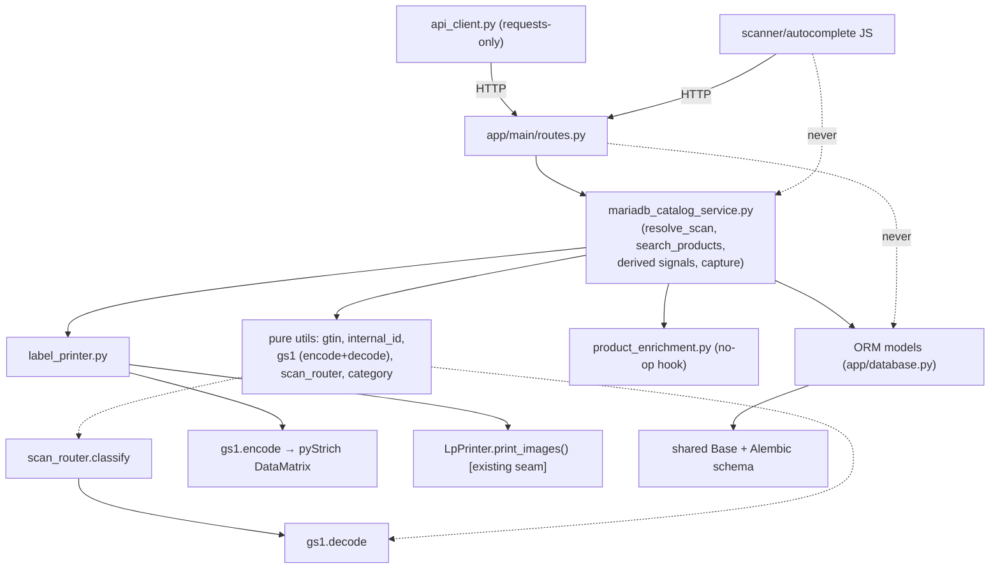
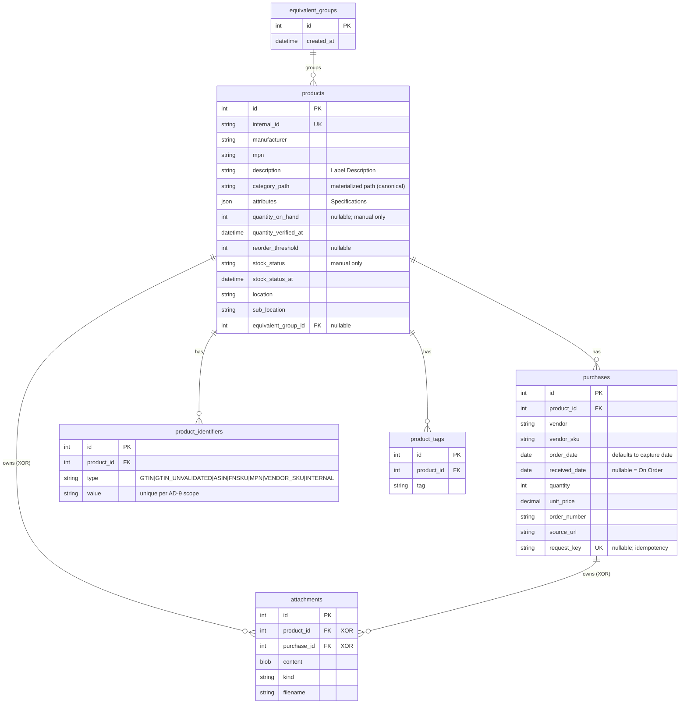

# Architecture Spine — Product Catalog & Purchase Tracking

## Design Paradigm

**Layered, service-oriented Flask** — the shape the existing app already converged on; this enhancement ratifies it rather than inventing.

| Layer | Home | Role |
| --- | --- | --- |
| HTTP / presentation | `app/main/` blueprint (routes) + `app/templates/`, `app/static/` (Bootstrap 5.3.2, Jinja2) | Request/response, CSRF, builds the `{success, …}` JSON envelope. No DB/ORM access. |
| Service | `app/mariadb_catalog_service.py` (new, models `InventoryService`) | All catalog business logic, queries, derived-signal computation, scan resolution, search. Acquired via app-factory injection. |
| Domain / persistence | `app/database.py` (ORM models on shared `Base`) + `app/models.py` (dataclass value objects, enums) | Enhanced-ORM entities; domain logic via `@hybrid_property`/`@property`. |
| Pure domain utils | `app/utils/*.py` | Framework-free, DB-free pure functions (normalization, encoding/decoding, classification). Single-source-of-truth per module. |
| Programmatic client | `app/api_client.py` (`requests`-only, vendorable) | Mirrors REST endpoints for headless use (NFR10). |

Dependency direction is one-way down the layers (see *Structural Seed*).

## Invariants & Rules

### AD-1 — Catalog entities extend the enhanced-ORM pattern `[ADOPTED]`
- **Binds:** all catalog entities (Product, Purchase, ProductIdentifier, ProductTag, EquivalentGroup, Attachment)
- **Prevents:** an epic introducing a parallel dataclass-domain/ORM two-layer split, a second `Base`, or JSON-blob-as-model
- **Rule:** Define each entity as one SQLAlchemy ORM class on the shared `Base` in `app/database.py`; put composite/validated sub-values in `app/models.py` dataclasses; bridge enums with `@hybrid_property` and value objects with `@property`, exactly as `InventoryItem` does. Enums are single-sourced in `app/models.py`.

### AD-2 — Business logic lives in the catalog service, never in routes `[ADOPTED]`
- **Binds:** all epics
- **Prevents:** raw ORM/SQL in routes; divergent per-epic return contracts
- **Rule:** All catalog queries and mutations go through `mariadb_catalog_service.py`, constructed with the injected `STORAGE_BACKEND` (`_get_storage_backend()`). Per-method session lifecycle is `try / except-log / finally-close`; mutations call `log_audit_operation`. Services return domain objects / `bool` / `None`; **routes** build the JSON envelope and pick the HTTP status.

### AD-3 — Integer surrogate PKs; `internal_id` is the business key
- **Binds:** all catalog tables and their relationships
- **Prevents:** two epics keying joins differently (numeric vs business key); string-FK sprawl
- **Rule:** Every catalog table has an integer surrogate PK. Relationships are FKs to those integer PKs via SQLAlchemy `relationship()`. `products.internal_id` is a separate `UNIQUE` business key used for URLs, labels, and scan lookup — never a foreign key target for internal joins.

### AD-4 — Identifier/encoding/classification logic is pure, in `app/utils/`, exhaustively tested
- **Binds:** Epics 2, 3, 4, 6 (GTIN normalize/validate, internal-ID generation, GS1 AI-96 encode/decode, scan classification, category-path normalization)
- **Prevents:** each epic reimplementing normalization/encoding/classification inline; silent data corruption (NFR7)
- **Rule:** These are module-level pure functions in `app/utils/` (`gtin.py`, `internal_id.py`, `gs1.py`, `scan_router.py`, `category.py`) with **no Flask/DB imports**, each its own single source of truth (the `location_validator.py` pattern), covered by exhaustive unit tests. The service calls them; routes and templates never re-derive. Anything requiring DB access is a **service** method, not a util (see AD-15).

### AD-5 — One scan classifier owns routing precedence; resolution is the service's
- **Binds:** Epic 4 and every surface that accepts a scan
- **Prevents:** client JS and multiple routes classifying the same scan differently; a malformed distributor barcode crashing the scan path
- **Rule:** `app/utils/scan_router.py` is the sole **classifier** and is pure (no DB). It implements the FR36 precedence in order — (1) GS1 AI-96 + configured token → `internal`; (2) ISO/IEC 15434 format-06 envelope → `ecia`; (3) all-digit length 8 or 12–14 with valid GTIN check digit → `gtin` (normalized); (4) else → `free_text`. Rule-1 recognition **delegates to `gs1.decode()`** (AD-16). On a malformed/unrecognized format-06 envelope it classifies as `free_text` carrying the raw scan and never raises (satisfies **NFR8**). It returns a frozen `ScanClassification` (AD-15); DB **lookup and the no-match free-text fallthrough live in the service** (AD-15), not the router.

### AD-6 — Stock status is stored-manual; all reorder signals are derived, never stored
- **Binds:** Epics 5, 7, 8, 10
- **Prevents:** the stored-vs-derived flip-flop (PRD C3); two epics writing derived state; two encodings of one predicate disagreeing
- **Rule:** The `stock_status` column stores ONLY the operator's manual assertion (`unknown|ok|low|out`). Three signals are **computed at read in the service and never persisted**: **Effective Low** = `stored ∈ {low,out} OR (quantity_on_hand IS NOT NULL AND reorder_threshold IS NOT NULL AND quantity_on_hand ≤ reorder_threshold)` — a `NULL` `reorder_threshold` makes the threshold branch false; **On Order** = existence of an unreceived Purchase for the product or any group sibling; **Recently Received** = existence of a Purchase for the product or any group sibling with `received_date ≥ today − N` days (`N` a named config value). The Effective-Low predicate is expressed **once** — a single SQLAlchemy hybrid expression / service method usable in both Python and SQL `WHERE` — and Epic 8's facet (AD-17) reuses it; no second hand-written copy. Receipt clears only a manual `low`/`out` to `ok`; it never writes `quantity_on_hand` and never writes a sibling's status.

### AD-7 — GTIN namespace is normalized + validated; unvalidated values are quarantined
- **Binds:** Epic 2
- **Prevents:** a garbage value squatting a real product's GTIN slot; normalization collisions (PRD H4)
- **Rule:** `ProductIdentifier(type, value)` is unique per its scope (AD-9). `GTIN` values are check-digit-validated and stored normalized to 14 digits — the GTIN uniqueness namespace, global. Check-digit failures are stored, if kept, under type `GTIN_UNVALIDATED`, **unnormalized and outside** the GTIN namespace.

### AD-8 — `internal_id` is service-generated and authoritative; GS1 grammar is config-driven
- **Binds:** Epics 1, 2, 6
- **Prevents:** two writers/sources for one business key; an uncaught collision; hardcoded AI/token
- **Rule:** `app/utils/internal_id.py` produces a **candidate** (pure). The **create-service is the sole writer**: it performs the insert and owns retry-on-`UNIQUE`-collision; the `products.internal_id` column carries **no** generating DB default. Any `INTERNAL`-type `ProductIdentifier` row is written in the **same transactional step** from the same value and is a derived read index, not independently editable. The label payload grammar (FNC1-first, AI 96, token `WIT` + `internal_id`) lives in `gs1.py` per AD-16; the AI number and token are config values, never literals.

### AD-9 — Capture de-dup is scoped per identifier type; idempotent over the whole transaction
- **Binds:** Epic 7 (and Epic 2's identifier uniqueness)
- **Prevents:** duplicate Products on repeat buys or retried requests; cross-vendor mis-attribution; silent over-merge on a reused Amazon ASIN (PRD C2/H3/M5)
- **Rule:** De-dup match precedence and **scope by type**: (1) a globally-unique identifier (`GTIN`, `INTERNAL`) — unscoped; (2) a vendor-namespaced identifier (`VENDOR_SKU`, `ASIN`, `FNSKU`) — scoped to the same vendor; (3) a prior `purchases.vendor_sku` — scoped to the same vendor. An **ASIN match is confirm-not-merge**: it attaches automatically only when manufacturer/MPN agree (or are absent on both); when they differ it requires explicit operator confirmation, never a silent merge (guards Amazon's documented ASIN reuse). Indexing an ASIN that already exists on another product is **rejected and surfaced**, never silently attached. `UNIQUE(type,value)` and `UNIQUE(request_key)` violations are caught as **domain errors**, not raw `IntegrityError`. `purchases.request_key` carries a `UNIQUE` constraint (owned by the Epic-1 schema); idempotency is enforced by that constraint (not app-level check-then-insert), and the idempotent unit is the **whole capture transaction** (Product + Purchase created atomically), so a retry returns the same Product URL regardless of where the first attempt failed.

### AD-10 — Equivalence is a same-part partition; group signals derive from siblings
- **Binds:** Epic 10 (and the reorder/on-order views in Epics 5, 7)
- **Prevents:** false over-merge of non-interchangeable parts; a group reorder line that contradicts a member's inbound order (PRD C1/H1/H2, NG11)
- **Rule:** Equivalent Products model only the *same manufacturer part, differently branded* equivalence class via a nullable `products.equivalent_group_id` FK — a partition, ≤1 group per product. Adding a product already in a different group is rejected (not silently moved). The **group reorder line** is Effective-Low **iff** every member is Effective Low **and** no member is On Order **and** no member is Recently Received — so an inbound order or recent receipt on any relabel suppresses the whole group. Group suppression is achieved **only** via the derived signals (AD-6), never by writing a sibling's stored status; FR33's manual-status clear stays scoped to the purchased product.

### AD-11 — Labels reuse the existing submission seam; only rendering is extended
- **Binds:** Epic 6
- **Prevents:** a forked print path; non-deterministic rasters (NFR9, NFR11)
- **Rule:** New catalog labels are new `LABEL_TYPES` entries (2×4, 1×2 only) plus a new generator branch at the generator-selection seam in `app/services/label_printer.py`. The generator renders the DataMatrix via **pyStrich**, **composites it together with the Label Description and Provenance Block into the full label raster** (as `BarcodeLabelGenerator` does today), and hands that composed raster `BytesIO` to the unchanged `LpPrinter.print_images()` submission seam. No new print/submission path, printer language, or driver. Rendering is deterministic for a given record. The catalog feature never emits a 4×6 label.

### AD-12 — Attachments are BLOB-in-DB with exactly one owner
- **Binds:** Epic 8 (attachments), Epic 1 (FR5)
- **Prevents:** orphan/ambiguous attachments; a second file-storage mechanism
- **Rule:** Attachment bytes are stored in a DB BLOB column (matching the `Photo` precedent), backed up with the database. Each row references **exactly one** of (`product_id`, `purchase_id`) — enforced by `CHECK ((product_id IS NULL) <> (purchase_id IS NULL))` (MariaDB 11.8 honors CHECK) / application invariant.

### AD-13 — New programmatic endpoints stay consumable by the requests-only client
- **Binds:** Epic 7 and any new REST surface intended for programmatic use
- **Prevents:** the standalone `api_client.py` drifting out of sync or gaining dependencies (NFR10)
- **Rule:** Each such endpoint gets a matching method + frozen result dataclass in `app/api_client.py`, using only `requests`. JSON API routes are `@csrf.exempt`, with the success envelope `{success: true, …}` and the **fixed error envelope** (see Conventions) so the frozen dataclasses are stable across epics.

### AD-14 — Schema changes are Alembic migrations; metal stock is untouched
- **Binds:** all epics
- **Prevents:** `create_all` drift; metal-stock regressions; a parallel location/vendor vocabulary (NFR9)
- **Rule:** All schema changes are Alembic migrations authored/run via `manage.py db`, chained from current HEAD `8213852b0b94`. Metal-stock tables and behavior are not restructured. Shared vocabularies (location, vendor) are reused by extending the `field-suggestions` source query / whitelist — never by forking a parallel field set.

### AD-15 — Scan seam contract: pure classification, service resolution, two named shapes
- **Binds:** Epics 4, 7, 9 (every scan consumer)
- **Prevents:** the AD-4-pure vs AD-5-lookup contradiction; an undefined "classification" shape each consumer fills differently
- **Rule:** Two frozen shapes are defined in `app/models.py`. `scan_router.classify(raw) → ScanClassification{ kind ∈ internal|ecia|gtin|free_text; normalized_value (14-digit for gtin, WIT-stripped id for internal, else None); ecia_fields: dict|None keyed exactly P,1P,Q,K,1K,9D,10D; raw }`. `mariadb_catalog_service.resolve_scan(raw) → ScanResolution{ classification, product|None, free_text_hits }` calls the classifier, then the DB, performing the FR36 no-match fallthrough via the shared search method (AD-17). Every scan consumer (Epics 4, 7, 9) depends only on these two shapes.

### AD-16 — One AI-96/`WIT`/FNC1 grammar, one config source
- **Binds:** Epics 2, 4, 6
- **Prevents:** encoder and decoder drifting; FR12c silently violated by literal defaults
- **Rule:** The GS1 element-string grammar is single-sourced in `app/utils/gs1.py`, exposing `encode(internal_id, *, ai, token)` **and** `decode(raw, *, ai, token) → InternalPayload|None` (decode absorbs FR37a FNC1 tolerance: GS `0x1D` / configured substitute / stripped). `scan_router` delegates rule-1 recognition to `gs1.decode()`; the label generator calls `gs1.encode()`. The AI number and token are read from **one** named config pair (`GS1_INTERNAL_AI`, `GS1_INTERNAL_TOKEN`) **in the service** and passed explicitly into both pure functions — **no literal defaults**. This makes FR12c ("one config change flips both encoder and router") mechanical.

### AD-17 — Single free-text search entrypoint
- **Binds:** Epics 4, 8
- **Prevents:** the scan box and the search page returning different results for the same query
- **Rule:** `mariadb_catalog_service.search_products(query, filters)` is the **sole** free-text search implementation (across identifiers, descriptions, notes, manufacturer, MPN). Epic 8's search (FR52) and the AD-15 scan free-text fallthrough both call it. The search **mechanism** (LIKE vs MariaDB FULLTEXT vs ranking) is deferred and decided in Epic 8; the **entrypoint** is fixed here.



## Consistency Conventions

| Concern | Convention |
| --- | --- |
| Naming | ORM class `PascalCase` singular; table `snake_case` plural; service `mariadb_catalog_service.py`; pure utils `app/utils/<concern>.py`; migration `versions/<12hex>_<slug>.py`. |
| Money & measures | `decimal.Decimal` with `ROUND_HALF_UP` for unit price and any dimension — never `float`. |
| Dates | Tolerant parsing via the existing `parse_date_value` / `safe_str` helpers; `order_date` defaults server-side to the capture date when omitted. |
| Schemaless data | Product **Specifications** live in a MariaDB **JSON** column (`attributes`) — the one sanctioned new column type (PRD NFR2); do not use comma-separated Text for structured specs. |
| Identifiers | `ProductIdentifier(type, value)` unique per AD-9 scope; `GTIN`/`INTERNAL` global, `VENDOR_SKU`/`ASIN`/`FNSKU` vendor-scoped; `GTIN` normalized-14, `GTIN_UNVALIDATED` as-entered; internal label token `WIT`+`internal_id`. |
| Category / Tag | Category = materialized-path string on `products`, **canonical form: lowercase, `/`-separated, no leading/trailing slash**; prefix filtering matches on a **segment boundary** (`path = X OR path LIKE 'X/%'`) via a shared `normalize_category_path()` util (used by Epics 3 and 8). Tags via a `product_tags` table. Both created inline via autocomplete-with-create. |
| Derived state | Effective Low, On Order, and Recently Received are computed at read in the service (AD-6); never a stored column. |
| API success | JSON routes `@csrf.exempt`, success envelope `{success: true, …}` + HTTP status; body via `request.get_json() or {}`. |
| API errors | Fixed error envelope on every new JSON route: `{success: false, error: {code: str, message: str, field?: str}}` — so AD-13's frozen client dataclasses stay stable across epics. The `app/exceptions.py` hierarchy maps into `error.code`. |
| Audit | `log_audit_operation` on every mutation. |
| Sessions | Per-method `session = self.Session()` … `try / except-log / finally: session.close()`; legacy `session.query(...)` with `and_/or_/desc/func` to match surrounding code. |
| Testing | Unit tests via `nox -s tests` (SQLite through `MariaDBStorage`, network blocked); E2E via `nox -s e2e` (20-min timeout) for scan-routing and label paths (NFR6); pure utils get exhaustive unit tests (NFR7). |

## Stack

*SEED — verified current 2026-07-22; the code owns this once it exists. Existing pins ratified against `requirements.txt`; one dependency added.*

| Name | Version |
| --- | --- |
| Python | 3.13 |
| Flask / Werkzeug | 3.1.3 / 3.1.8 |
| SQLAlchemy | 2.0.51 (legacy `Query` API) |
| Alembic | 1.18.5 (via `manage.py db`) |
| PyMySQL | 1.2.0 |
| MariaDB | 11.8 |
| Pillow | ≥12.3.0 |
| PyMuPDF (`fitz`) | 1.28.0 (PDF handling) |
| pt-p710bt-label-maker | git `@jantman` (label submission via `lp`/CUPS) |
| **pyStrich[png]** | **0.18 — NEW: GS1 DataMatrix rendering (pure-Python, no system dep)** |
| Bootstrap | 5.3.2 |

## Structural Seed

**Core entities** (names + relationships; attribute-level invariants are ADs, not this diagram):



**Source tree (new/changed only):**

```text
app/
  database.py                    # + Product, Purchase, ProductIdentifier, ProductTag,
                                 #   EquivalentGroup, Attachment ORM classes (shared Base)
  models.py                      # + catalog value-objects/enums; ScanClassification,
                                 #   ScanResolution, InternalPayload frozen dataclasses
  mariadb_catalog_service.py     # NEW — catalog logic, derived signals, resolve_scan,
                                 #   search_products, capture (sole internal_id writer)
  api_client.py                  # + capture/product methods + frozen result dataclasses
  main/routes.py                 # + catalog JSON endpoints (@csrf.exempt), capture, scan
  services/
    label_printer.py             # + LABEL_TYPES 2x4/1x2 catalog entries + DataMatrix branch
    product_enrichment.py        # NEW — Enrichment Interface (FR60), no-op impl; create-path hook
  utils/
    gtin.py                      # NEW — normalize + check-digit (pure)
    internal_id.py               # NEW — internal-id CANDIDATE generator (pure)
    gs1.py                       # NEW — AI-96 encode + decode, FNC1 grammar (pure)
    scan_router.py               # NEW — FR36 precedence classifier (pure); delegates to gs1.decode
    category.py                  # NEW — normalize_category_path (pure)
  static/js/
    field-autocomplete.js        # + autocomplete-WITH-CREATE variant for Category/Tag
migrations/versions/
  <new>_catalog_tables.py        # down_revision = 8213852b0b94
```

**Operational envelope:** no new services or containers (NFR1) — the enhancement ships inside the existing Docker image on the Raspberry Pi 5, sharing its MariaDB, auth, and backups. The only new runtime dependency is the pure-Python `pyStrich` (no `apt` package). Attachment BLOBs grow the DB; the existing DB backup covers them. Label printing continues via `lp`/CUPS unchanged.

## Capability → Architecture Map

| Capability / Epic | Lives in | Governed by |
| --- | --- | --- |
| 1 · Product/Purchase data model | `database.py`, `models.py`, migration | AD-1, AD-3, AD-14, AD-12 |
| 2 · Identifiers & internal encoding | `utils/gtin.py`, `utils/internal_id.py`, `utils/gs1.py`, `database.py` | AD-4, AD-7, AD-8, AD-16 |
| 3 · Taxonomy & tagging | `products.category_path`, `product_tags`, `utils/category.py`, `field-autocomplete.js` | AD-4, AD-14; Category/Tag convention |
| 4 · Scan routing & ECIA | `utils/scan_router.py`, `mariadb_catalog_service.resolve_scan`, `main/routes.py` | AD-4, AD-5, AD-15, AD-16 |
| 5 · Stock & reorder signals | `mariadb_catalog_service.py` | AD-6, AD-10 |
| 6 · Label generation | `services/label_printer.py`, `utils/gs1.py`, pyStrich | AD-8, AD-11, AD-16 |
| 7 · Order-time capture API | `main/routes.py`, `api_client.py`, `mariadb_catalog_service.py`, `services/product_enrichment.py` | AD-9, AD-13, AD-6, AD-15 |
| 8 · Search, retrieval, attachments | `mariadb_catalog_service.search_products`, `attachments` table | AD-2, AD-12, AD-17 |
| 9 · Handheld & touch | `templates/`, `static/` (Bootstrap responsive) | NFR4; AD-15 (scan-result view) |
| 10 · Equivalent products | `products.equivalent_group_id`, `mariadb_catalog_service.py` | AD-10, AD-6 |
| Enrichment Interface (FR60/FR61) | `services/product_enrichment.py` (no-op hook the create path calls) | AD-2, AD-13 |

## Deferred

- **Q1 — scanner 2D round-trip (blocking spike, gates Epic 4).** Whether the Tera HW0009 round-trips a GS1 DataMatrix `WIT…` payload recognizably (data chars intact; FNC1 as GS/substitute/stripped; AIM `]d1`). Hardware-empirical; resolve before building the internal-ID scan path. Owner: build spike.
- **Q7 — pyStrich GS1 scan-test (blocking spike, gates Epic 6).** pyStrich's GS1 support is ~6 weeks old; print a sample and verify it scans/validates as a GS1 DataMatrix before relying on it. Fallback: `treepoem` + Ghostscript (documented in memlog). Owner: build spike.
- **Full-text search *mechanism* (Epic 8).** LIKE vs MariaDB `FULLTEXT` vs ranking. The **entrypoint is fixed** (AD-17: one `search_products()` method that both the scan fallthrough and Epic-8 search call), so this carries **no cross-epic divergence** — only the internal implementation is deferred, decided in Epic 8 at build time. At hundreds–low-thousands of products, `LIKE`-based search likely suffices.
- **Category storage depth.** Materialized-path string + canonical form are fixed; whether rename-with-descendants (FR17) needs a helper index or a `categories` table is an Epic-3 implementation detail, not a cross-epic invariant.
- **Attachment size limits / PDF thumbnailing.** Whether to cap BLOB size or generate PyMuPDF thumbnails is an Epic-8 detail; the storage mechanism (AD-12) is fixed.
