# Workshop Inventory Tracking - User Manual

## Table of Contents

**Getting oriented**

1. [Getting Started](#getting-started)
2. [Overview](#overview)

**Inventory — tracking physical stock**

3. [Adding New Inventory](#adding-new-inventory)
4. [Label Printing](#label-printing)
5. [Managing Existing Inventory](#managing-existing-inventory)
   - [Photo Management](#photo-management)
6. [Advanced Search](#advanced-search)
   - [Find Stock for a Part](#find-stock-for-a-part)
7. [Batch Operations](#batch-operations)

**Product Catalog — what you bought, what it cost, where it came from**

8. [The Product Catalog](#the-product-catalog)
9. [Adding a Product](#adding-a-product)
10. [Product Identifiers](#product-identifiers)
11. [Scanning Products](#scanning-products)
    - [Distributor Labels](#distributor-labels)
12. [Recording Purchases](#recording-purchases)
13. [Which Vendors Are Supported](#which-vendors-are-supported)
14. [Capturing an Order When You Place It](#capturing-an-order-when-you-place-it)
    - [Amazon Orders](#amazon-orders)
    - [DigiKey Orders](#digikey-orders)
    - [McMaster-Carr Orders](#mcmaster-carr-orders)
15. [Printing Product Labels](#printing-product-labels)
16. [Stock Levels and Reordering](#stock-levels-and-reordering)
17. [Product Attachments](#product-attachments)
18. [Finding Products](#finding-products)
19. [Categories and Tags](#categories-and-tags)

**Across both halves**

20. [Locations and Vendors: One Shared Vocabulary](#locations-and-vendors-one-shared-vocabulary)
21. [Data Export](#data-export)
22. [REST API](#rest-api)
23. [Help and Utilities](#help-and-utilities)
24. [Tips and Best Practices](#tips-and-best-practices)
25. [Troubleshooting](#troubleshooting)
26. [Quick Reference Card](#quick-reference-card)

## Getting Started

### System Requirements
- Modern web browser (Chrome, Firefox, Safari, Edge)
- Internet connection for database access
- Barcode scanner (optional, keyboard wedge type recommended)

### First Time Setup
1. Open your web browser and navigate to the application URL
2. The application will automatically connect to the database
3. For data export functionality, ensure Google Sheets credentials are configured (optional)

### Main Navigation
- **Home** - Dashboard with application overview and quick actions
- **Add Item** - Add new inventory items
- **Search** - Advanced search and filtering
- **Inventory List** - View and manage all inventory
- **Move Items** - Batch move operations
- **Shorten Items** - Cut materials to length
- **Products** - The product catalog: what a part is, what it cost, where it came from
- **Scan box** - In the header on every page; scan or type a code from wherever you are

## Overview

The Workshop Inventory Tracking system has **two halves**, and knowing which one
you are in answers most questions about where to look.

**Inventory** is your physical stock -- metal, hardware and other workshop
materials. Every piece carries a JA ID, and cutting one in half leaves a history
that says so. It answers *what do I have, how long is it, and where is it?* The
inventory half tracks:

- **Physical Properties**: Length, width, thickness, weight
- **Material Information**: Type, shape, material composition
- **Threading Details**: Series, handedness, size, form
- **Location Tracking**: Current location and sub-location
- **Purchase Information**: Date, price, vendor details
- **Status**: Active/inactive status for each item

**The product catalog** is what you bought. It answers *what is this thing,
what did it cost, and where did it come from?* -- the question a part in a bin
six months later cannot answer for itself. The catalog half tracks
descriptions and specifications, barcodes and part numbers, purchases with their
vendors and prices, how many you have and what needs reordering, categories and
tags, and attachments such as datasheets and receipts.

The two are separate, and the distinction is the one worth holding onto: a
product is a *kind* of thing you buy; an inventory item is a specific piece of
stock with a JA ID and a cutting history. Buying a second reel of the same wire
adds a purchase to one product; cutting a bar in two makes a new inventory item.

They meet in exactly one place -- the vocabulary of locations and vendors, which
is shared across both halves. See
[Locations and Vendors: One Shared Vocabulary](#locations-and-vendors-one-shared-vocabulary).

## Adding New Inventory

### Using the Add Item Form

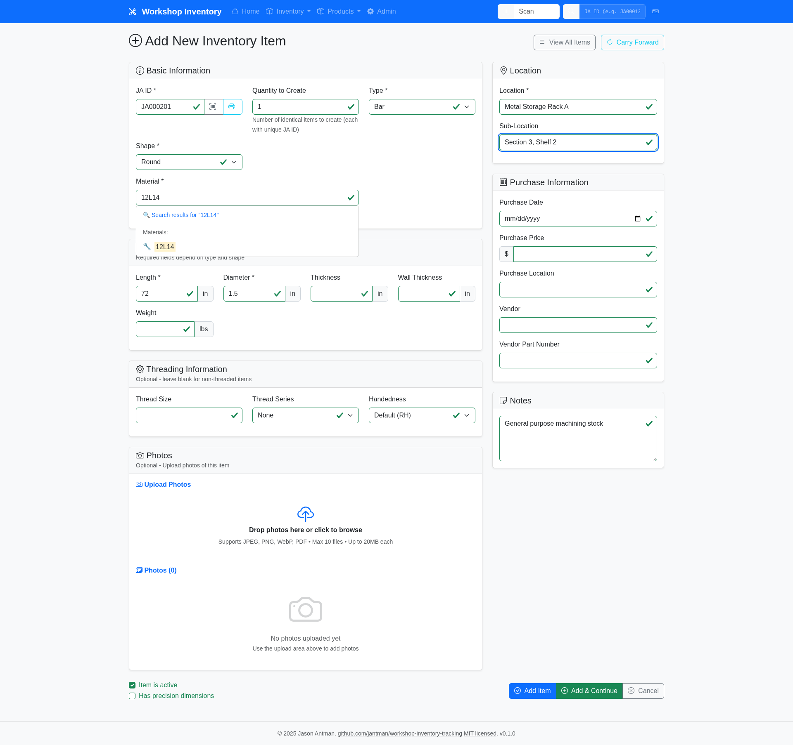
*Add item interface showing all available fields for tracking materials*

1. **Navigate**: Click "Add Item"
2. **Required Fields** (marked with *):
   - **JA ID**: Unique identifier (e.g., "JA12345")
   - **Type**: Rod, Tube, Sheet, Hardware, etc.
   - **Shape**: Round, Square, Rectangular, etc.
   - **Material**: Steel, Aluminum, Brass, etc.

3. **Dimensions**: Enter measurements in inches
   - Length, width, thickness (as applicable)
   - Use fractions (e.g., "1 1/8") or decimals (e.g., "1.125")
   - Wall thickness for tubes

4. **Threading** (if applicable):
   - Series: UNC, UNF, M (metric), NPT, etc.
   - Handedness: Right or Left
   - Size: e.g., "1/4-20", "M10x1.5", "3/4-16"
   - Form: UN, ISO Metric, Acme, Trapezoidal, etc.

5. **Location Information**:
   - Location: Main storage area
   - Sub-Location: Specific bin, shelf, or section

6. **Purchase Details** (optional):
   - Purchase date, price, location
   - Vendor and part number

7. **Notes**: Additional information or special handling requirements

### Barcode Scanning
- **JA ID Field**: Scan barcode to automatically fill
- **Location Field**: Scan location barcode for consistency
- **Submit Code**: Scan ">>DONE<<" barcode to submit form

### Form Features
- **Auto-complete**: Previous entries suggest values as you type. The
  Thread Size, Purchase Location, Vendor, Location, and Sub-Location
  fields show database-backed suggestions in a dropdown when focused
  or typed into. Sub-Location suggestions are scoped to the currently
  entered Location. Material has its own taxonomy-backed selector.
  Programmatic clients can pull the same lists via the
  [`/api/inventory/field-suggestions/<field>`](#get-apiinventoryfield-suggestionsfield)
  endpoint.
- **Auto-save**: Form data is preserved if page refreshes
- **Validation**: Real-time feedback on field formats

### Streamlined Data Entry

#### Bulk Creation ("Quantity to Create")

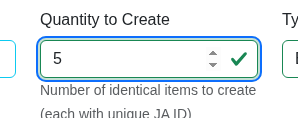
*Bulk creation preview showing sequential JA IDs that will be created*

The **Quantity to Create** field allows you to create multiple identical items with sequential JA IDs in a single form submission. This is ideal when you have multiple pieces of the same material that need individual tracking.

**How to use:**
1. Fill out the add item form completely with all item details
2. Set **Quantity to Create** to the number of items you want (1-100)
   - Default is 1 (single item)
   - For multiple items, a preview shows the JA ID range that will be created
3. Submit the form
4. For bulk creation (quantity > 1):
   - A modal appears showing all created JA IDs
   - You can print labels for all items from the modal
   - All items are identical except for their unique JA IDs

**What gets copied:**
- ALL fields: type, shape, material, dimensions, location, notes, vendor info, etc.
- Sequential JA IDs are automatically assigned starting from the next available number

**What doesn't get copied:**
- History (each item is a fresh record)

**Note:** Photos are not automatically copied during bulk creation. However, you can manually copy photos after creation using the photo copying feature (see [Photo Management](#photo-management)).

**Example use case:**
You receive 10 identical steel bars from a supplier. Instead of creating 10 separate entries, fill out the form once with all details and set "Quantity to Create" to 10. The system creates JA000001 through JA000010 (or whatever the next available numbers are) with identical specifications.

#### Carry Forward Button
The **Carry Forward** button (located in the top-right header) allows you to copy common field values from the previously added item into the current form. This is useful when adding multiple similar items.

**Fields copied forward:**
- Type, Shape, Material
- Location and Sub-Location
- Dimensions (length, width, thickness, wall thickness, weight)
- Thread Size, Series, and Handedness
- Vendor, Vendor Part Number, Purchase Location, and Purchase Date
- Notes

**Fields NOT copied (remain blank):**
- JA ID (you'll need to enter unique ID)
- Purchase Price
- Photos

**How to use:**
1. Add your first item normally
2. On the next add form, click **Carry Forward** to populate common fields
3. Enter the unique JA ID (and modify any fields as needed for the new item)
4. Submit as normal

#### Add & Continue Button
The **Add & Continue** button (green button next to "Add Item") submits the current item and immediately returns to a fresh add form, streamlining bulk entry workflows.

**How to use:**
1. Fill out the add item form completely
2. Click **Add & Continue** instead of **Add Item**
3. The item is saved and you're returned to a blank add form
4. Repeat for additional items
5. Use **Add Item** (blue button) for your final item to return to the inventory list

**When to use each:**
- **Carry Forward**: Adding multiple similar items (same material, location, etc.)
- **Add & Continue**: Adding multiple different items in sequence
- **Combined approach**: Use Add & Continue, then Carry Forward for maximum efficiency

## Label Printing

The system can print barcode labels for any JA ID using connected label printers. Labels can be printed from the Add Item form, Edit Item form, in bulk from the Inventory List, or in bulk immediately after creating a batch of items with the Add Item form's "Quantity to Create".

These are inventory labels, carrying a JA ID. Catalog products get their own
labels, carrying the product's internal code -- see
[Printing Product Labels](#printing-product-labels).

### Accessing Label Printing

#### From Add Item Form
1. Enter a valid JA ID (format: JA######)
2. The printer button (📄) will become enabled next to the JA ID field
3. Click the printer button to open the label printing dialog

#### From Edit Item Form
1. The printer button is always enabled since the JA ID already exists
2. Click the printer button next to the JA ID field
3. The label printing dialog will open

#### From Inventory List (Bulk Printing)
1. Navigate to the Inventory List page
2. Select one or more items using the checkboxes in the leftmost column
   - You can select items individually by clicking their checkboxes
   - Or use the "Select All" option from the Options dropdown to select all visible items
3. Click the "Options" dropdown button in the top-right corner
4. Select "Print Labels" from the dropdown menu
5. The bulk label printing dialog will open showing all selected items

#### After Creating a Batch of Items
1. On the Add Item form, set "Quantity to Create" to more than 1 and submit
2. A print dialog opens over the form listing every JA ID that was just created
3. Choose a label type and print, or dismiss the dialog — the items are already
   created either way, and dismissing changes nothing about them

### Using the Label Printing Dialog

1. **Select Label Type**: Choose from available label types:
   - **Sato 1x2**: Standard 1" × 2" labels
   - **Sato 1x2 Flag**: 1" × 2" labels with flag mode (rotated barcodes)
   - **Sato 2x4**: Larger 2" × 4" labels
   - **Sato 2x4 Flag**: 2" × 4" labels with flag mode
   - **Sato 4x6**: Large 4" × 6" labels
   - **Sato 4x6 Flag**: 4" × 6" labels with flag mode

2. **Set the Number of Labels**: "Number of labels" controls how many copies of
   this item's label to print. It accepts whole numbers from 1 to 99 and starts
   at 1. All the copies are produced in a single print job.
3. **Print Label**: Click "Print Label" to send the job to the printer
4. **Success Confirmation**: A green success message will appear when printing completes
5. **Auto-close**: The dialog automatically closes after successful printing

If the number of labels is blank, fractional, or outside 1–99, nothing is
printed and the dialog tells you the allowed range. The number is not clamped
for you — correct it and print again.

### Label Type Selection

#### Add Item Form
- Label type selection is **remembered** between uses
- Your last selected label type will be pre-selected the next time you print
- This helps speed up workflows when printing many similar labels

#### Edit Item Form
- Label type selection is **not remembered**
- You must select the label type each time
- This prevents confusion when editing different items

#### Inventory List (Bulk Printing)
- Label type selection is **not remembered** between sessions
- You must select the label type each time you open the bulk printing dialog
- All selected items will be printed with the same label type

#### The Number of Labels Is Never Remembered
Unlike the label type on the Add Item form, the label count is **not**
remembered. Every dialog opens at 1, on every surface. Printing five copies of
one label does not quietly arm the next print for five as well.

### Using the Bulk Label Printing Dialog

When printing labels for multiple items from the Inventory List:

1. **Review Selected Items**: The dialog displays all selected items with their JA IDs
2. **Select Label Type**: Choose the label type to use for all selected items
   - The same label type will be used for all items in the batch
3. **Set Labels per Item**: "Labels per item" is how many labels each selected
   item gets — not how many items there are. Three items at 2 labels per item
   produces six labels. It accepts whole numbers from 1 to 99 and starts at 1.
4. **Print All Labels**: Click "Print All Labels" to start the batch printing process
5. **Monitor Progress**: A progress bar shows the printing status
   - Current item being printed, and its label count when above 1
   - Number of items completed
   - Percentage complete
6. **Review Results**: After completion, the dialog shows:
   - How many labels were printed and how many items they covered, as
     `Complete: 6 labels for 3 items, 0 failed`
   - Number of failures (if any)
   - Detailed error messages for any failed prints
   - An item whose print failed counts as **zero** labels, never a partial
     number — all of one item's copies are a single print job
7. **Close or Retry**: Click "Done" to close the dialog
   - Your item selection remains unchanged for convenience
   - You can retry printing if needed

The dialog offered after a batch creation works the same way, with one thing
worth calling out: its "Labels per item" always starts at 1, whatever quantity
produced the batch. Creating 8 items does not mean 8 labels each — those are
two different numbers and the dialog keeps them apart.

**Tips for Bulk Printing:**
- Print labels in batches of similar sizes to ensure label consistency
- Review the selected items list before printing to avoid mistakes
- If some labels fail to print, the dialog will show which ones need to be retried
- The progress bar helps monitor large batch jobs

### Supported Printers

The system supports Sato label printers with the following configurations:
- **sato2**: 1" × 2" label printer
- **sato3**: 2" × 4" label printer  
- **SatoM48Pro2**: 4" × 6" label printer

### Flag Mode Labels

Flag mode creates labels with rotated barcodes at both ends, making them easier to read when wrapped around cylindrical objects like rods or tubes.

### Troubleshooting Label Printing

#### Printer Not Responding
- Verify the printer is powered on and connected
- Check that the correct printer driver is installed
- Ensure the printer name matches the system configuration

#### Label Format Issues
- Verify you selected the correct label type for your printer
- Check that labels are loaded correctly in the printer
- Ensure label size matches the selected type

#### Barcode Scanning Issues
- Use high contrast settings if barcodes appear faint
- Verify label material is compatible with your scanner
- Clean scanner lens if having reading difficulties

## Managing Existing Inventory

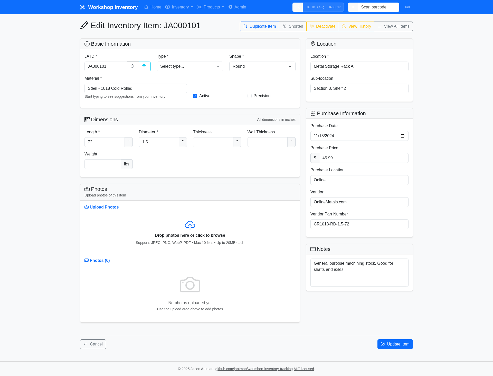
*Edit interface with complete item details, photo management, and history access*

### Viewing Inventory
1. **Inventory List**: View all items with sorting and filtering
2. **Search Results**: View items matching search criteria
3. **Item Details**: Click any item to view complete information

#### Inventory List Filters
The inventory list page provides several filters to help you find items:

- **Status**: Filter by item status
  - **Active Only** (default): Shows only active/available items
  - **Inactive Only**: Shows only inactive/used items
  - **All Items**: Shows both active and inactive items
- **Type**: Filter by item type (Bar, Sheet, Tube, Channel, etc.)
- **Material**: Search/filter by material name
- **Search**: Search across JA ID, location, and notes fields

All filtering happens instantly as you type or change selections. You can also click column headers to sort the results.

### Updating Items
- Edit items directly through the web interface
- Navigate to any item's edit page from inventory list or search results
- All fields can be updated except JA ID (which identifies the item)

### Duplicating Items
The **Duplicate** button on the edit page allows you to create copies of existing items with new sequential JA IDs. This is useful when you acquire more of the same item.

**How to use:**
1. Navigate to the edit page for the item you want to duplicate
2. Click the **Duplicate Item** button in the page header
3. In the modal that appears:
   - View a summary of the item being duplicated
   - Set the quantity (1-100) of duplicates to create
   - Preview shows the JA ID range that will be created
4. If you have unsaved changes on the edit form:
   - Choose whether to **Save changes** (apply edits to source and duplicates) or **Discard changes** (use original values)
5. Click **Create Duplicates**
6. Success message confirms creation

**What gets duplicated:**
- ALL fields: type, shape, material, dimensions, threading, location, vendor info, notes, etc.
- **Photos**: ALL photos are automatically copied from the source item to each duplicate
- Sequential JA IDs are automatically assigned

**What doesn't get duplicated:**
- History (duplicates have no modification history)
- Timestamps (duplicates get current date/time)

**Photo Copying:** When duplicating items, all photos from the source item are automatically copied to each new duplicate. The system uses efficient storage - photo data is shared between items rather than duplicated, saving storage space.

**Example use case:**
You have an item JA000050 (a 36" steel bar) and acquire 5 more identical bars. Open JA000050's edit page, click Duplicate, set quantity to 5, and create. The system creates JA000051 through JA000055 with identical specifications.

### Photo Management

The system allows you to attach photos to inventory items and copy photos between items. Photos can be automatically copied during item duplication or manually copied between any items.

#### Uploading Photos


*Photo upload interface for attaching images to inventory items*

Photos can be uploaded when adding or editing items:
1. Navigate to the Add Item or Edit Item page
2. Scroll to the **Photos** section
3. Click **Choose Files** or drag and drop images
4. Supported formats: JPEG, PNG, WebP, PDF
5. Multiple photos can be uploaded at once
6. Photos are automatically resized to three sizes: thumbnail, medium, and original

#### Viewing Photos

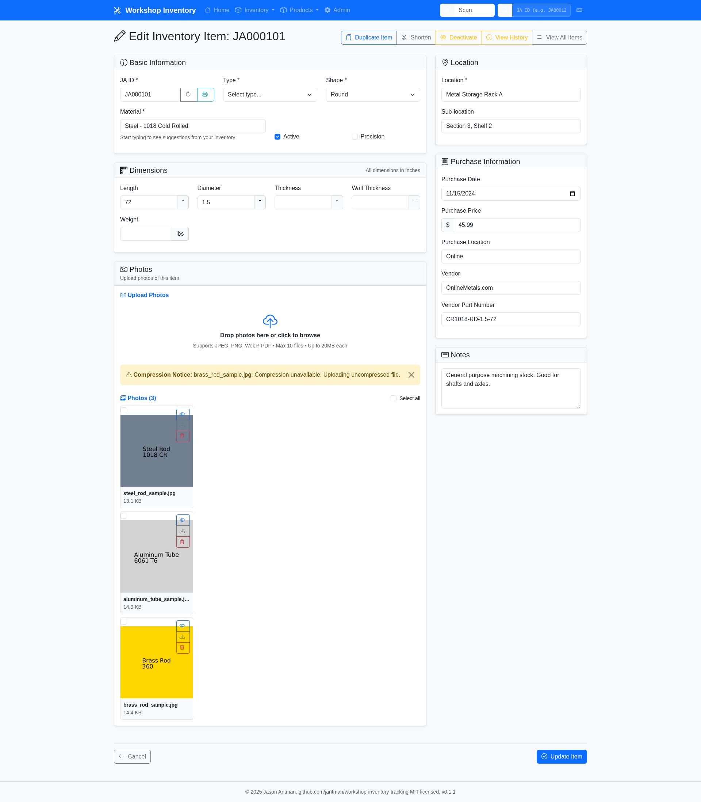
*Gallery view showing multiple photos attached to an item*

- **Inventory List**: Photo count displayed in the table (e.g., "📷 3" indicates 3 photos)
- **Item Details Modal**: Click any item to view full-size photos in a gallery
- **Edit Page**: View and manage all photos for an item

#### Removing Photos

On the Add Item and Edit Item pages, each photo carries a tick box:

- Tick several and press **Delete Selected** -- one confirmation, naming how
  many photos are going, then they all go.
- **Select all** takes every photo in the gallery; pressing it again clears the
  selection.
- The trash button on a single photo removes just that one and asks about that
  one.

The gallery in the item details modal is read-only, so it offers none of these.

#### Copying Photos Between Items

There are two ways to copy photos between items:

##### 1. Automatic Photo Copying (During Duplication)

When duplicating items, photos are **automatically copied** to all new duplicates:
- Navigate to the edit page for an item with photos
- Click **Duplicate Item**
- Set the quantity of duplicates to create
- Click **Create Duplicates**
- All photos from the source item are copied to each new duplicate
- Success message shows: "Item duplicated as [JA ID]. N photos copied."

**Storage Efficiency:** The system uses smart storage - photo data is shared between items rather than duplicated, saving disk space.

##### 2. Manual Photo Copying (From Inventory List)

For copying photos between existing items, use the photo clipboard workflow from the Inventory List page:

**Step 1: Copy Photos**
1. Navigate to **Inventory List** (`/inventory`)
2. Select **one item** that has photos (the source item)
   - The "Copy Photos From This Item" option is only enabled when:
     - Exactly one item is selected, AND
     - That item has at least one photo
3. Click **Options** dropdown → **Copy Photos From This Item**
4. A banner appears showing: "📋 N photo(s) from [JA ID] ready to paste. Select target items and click 'Paste Photos'."
5. The selection is automatically cleared, ready for you to select target items

**Step 2: Paste Photos**
1. Select **one or more target items** (items that will receive the photos)
2. Click **Options** dropdown → **Paste Photos To Selected**
3. Confirm the paste operation
4. Photos are **appended** to any existing photos on the target items (not replaced)
5. Success message shows: "Copied N photo(s) to M item(s)"
6. Photo clipboard is automatically cleared

**Additional Options:**
- **Clear Photo Clipboard**: Cancel the copy operation without pasting
- The photo clipboard persists across page navigation within the same browser session

**Example Workflow:**
You just created 5 new metal rod items (JA000550-JA000554) and want to copy photos from an existing similar item (JA000123):
1. Go to Inventory List
2. Find and select item JA000123
3. Click Options → "Copy Photos From This Item"
4. Search/filter for items JA000550-JA000554
5. Select all 5 new items
6. Click Options → "Paste Photos To Selected"
7. Confirm the operation
8. All 3 photos from JA000123 are now on each of the 5 new items

**Photo Copying Rules:**
- Photos are **appended** to existing photos (not replaced)
- If a target item already has 2 photos and you paste 3 photos, it will have 5 photos total
- The display order is preserved from the source item
- Source item's photos remain unchanged
- Storage is efficient - photo data is shared, not duplicated

#### Deleting Photos

To delete a photo from an item:
1. Navigate to the Edit Item page
2. Find the photo in the Photos section
3. Click the **Delete** button next to the photo
4. Confirm the deletion
5. If other items share the same photo, only the association is removed (photo data remains for other items)
6. If no other items use the photo, it is completely removed from the system

### Item Status
- **Active**: Available for use
- **Inactive**: Used up, cut down, or removed

### Parent-Child Relationships & Item History
- When items are shortened, complete history is tracked
- Original item becomes inactive while maintaining full record
- New item references parent item for traceability

#### Viewing Item History

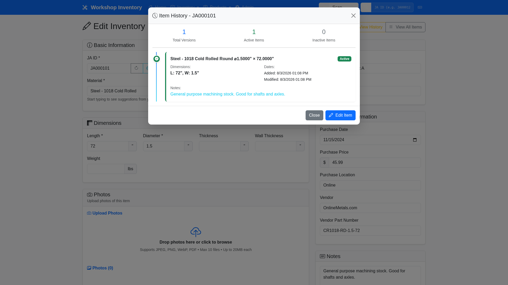
*History modal showing complete modification timeline for an item*

**Multiple Access Points:**
- **📋 Inventory List**: Clock icon (🕒) in the Actions column of any item
- **🔍 Search Results**: Clock icon (🕒) in the Actions column of search results
- **👁️ Item Details Modal**: "View History" button in modal footer (both list and search views)
- **✏️ Edit Form**: "View History" button in the page header

**History Modal Features:**
- **Timeline Display**: 
  - Most recent changes at the top
  - Visual indicators for active (green) vs inactive (gray) entries
  - Complete dimension changes and modification notes
  - Timestamps for when each version was created/modified
- **Summary Information**: Total versions, active items, and inactive items count
- **Easy Navigation**: Seamlessly transitions between details and history views

#### Technical Details
- **Item History API**: Access complete modification history via `/api/items/{JA_ID}/history`
  - Returns chronological list of all versions of an item
  - Shows active/inactive status for each version
  - Includes dimensions, dates, and modification details
- **Multi-Row Support**: System properly handles multiple database entries per JA ID
  - UI always displays current active item data
  - Historical versions remain accessible via API and History UI
  - Search and filtering only return active items by default

## Advanced Search

### Search Interface

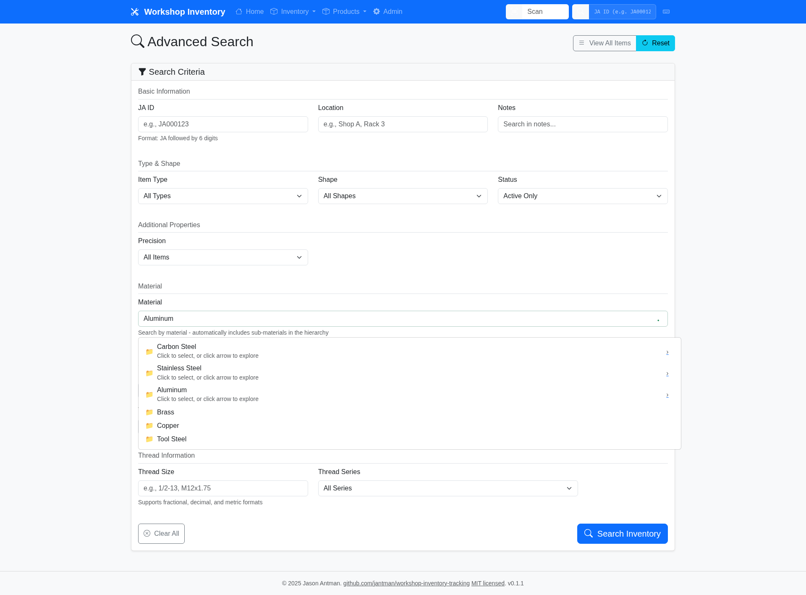
*Advanced search interface with range queries, filters, and multiple criteria*

Access via "Search" menu

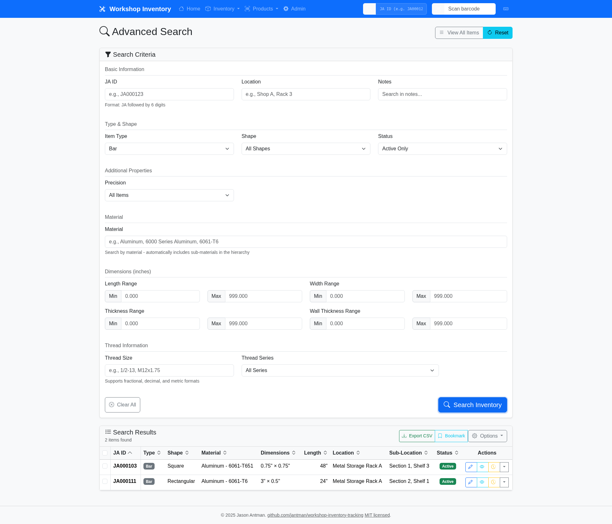
*Search results displaying matching items with all relevant details*

### Filter Categories

#### 1. Basic Filters
- **Status**: Active/inactive items
- **Type**: Rod, tube, sheet, hardware, etc.
- **Shape**: Round, square, rectangular, etc.
- **Material**: Hierarchical material search with autocomplete (see below)

#### 2. Dimension Ranges
- **Length**: Min and max values
- **Width**: Min and max values  
- **Thickness**: Min and max values
- **Wall Thickness**: Min and max values
- **Weight**: Min and max values

#### 3. Threading
- **Thread Series**: UNC, UNF, M, NPT, etc.
- **Thread Handedness**: Right/left
- **Thread Size**: Specific size patterns
- **Thread Form**: UN, ISO Metric, Acme, etc.

#### 4. Location
- **Location**: Main storage areas
- **Sub-Location**: Specific locations

#### 5. Purchase Information
- **Purchase Date Range**: Date range filters
- **Vendor**: Specific suppliers
- **Price Range**: Cost filters

#### 6. Text Search
- **Notes**: Search within notes field
- **Vendor Part**: Search part numbers

### Hierarchical Material Search

The material search field features intelligent autocomplete and hierarchical matching:

**Autocomplete Features:**
- **Progressive Disclosure**: Shows top-level material categories when empty
- **Smart Filtering**: Type to filter across all taxonomy levels
- **Navigation Mode**: Browse through categories → families → specific materials
- **Keyboard Support**: Navigate suggestions with arrow keys, select with Enter

**Hierarchical Matching:**
When you search for a material, the system automatically includes all sub-materials in the hierarchy:
- Searching for **"Aluminum"** (category) returns items made of:
  - "Aluminum" (exact match)
  - "6000 Series Aluminum" (family)
  - "6061-T6", "6063-T5" (specific alloys)
  - All other aluminum sub-materials
- Searching for **"6000 Series Aluminum"** (family) returns items made of:
  - "6000 Series Aluminum" (exact match)
  - "6061-T6", "6063-T5", etc. (specific alloys in this family)
- Searching for **"6061-T6"** (specific material) returns:
  - Only items made of "6061-T6" (leaf materials have no children)

This hierarchical search makes it easy to find all items of a general material type without needing to remember every specific alloy or variant.

### Search Tips
- **Multiple Filters**: Combine filters for precise results
- **Range Queries**: Use min/max for dimensions
- **Hierarchical Materials**: Search broad categories to find all variants
- **Export Results**: Download search results as CSV
- **Bookmark Searches**: Save frequently used search URLs

### Find Stock for a Part

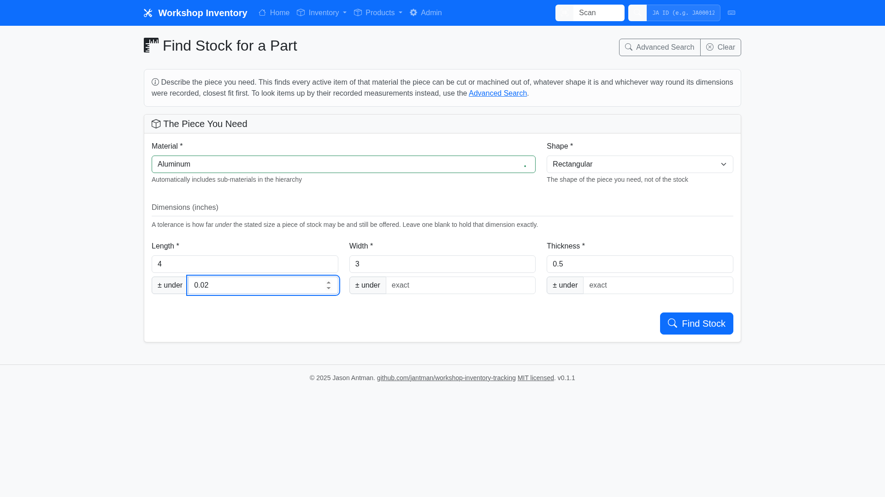
*Describing the piece you need: material, shape, dimensions and an optional tolerance on each*

Access via **Inventory → Find Stock for a Part**.

The Advanced Search above answers *which records carry these measurements*. This
one answers a different question: **I need a piece of this material this big —
what on the shelves can give me one?**

That difference matters more than it sounds. Length, Width and Thickness are
three separate labelled fields, and the Advanced Search compares each one against
its own namesake — so a bar recorded as 0.5 × 4 × 3 does not answer a search for
0.5 × 3 × 4, though it is the same bar and would be turned the same way in the
vise. Find Stock ignores the labels. It works out what solid each item's record
describes, and asks whether the piece you need can be cut out of it, in any
orientation and whatever shape the stock happens to be.

#### Describing the piece

- **Material** — matched hierarchically, exactly as it is in the Advanced
  Search: asking for Aluminum finds 6061-T6.
- **Shape** — the shape of the piece **you need**, not of the stock. Rectangular
  takes a length, a width and a thickness; Round takes a diameter and a length.
- **Dimensions** — the smallest block the finished part will fit inside.
- **Tolerance** — beside each dimension, how far *under* the stated size a piece
  of stock may be and still be offered. Leave one blank and that dimension is
  held exactly. Tolerance is per dimension on purpose: a length is usually
  forgiving where a finished thickness is not, and one number for the whole
  request would buy slack on the length at the price of returning stock that is
  too thin.

#### What comes back

Every active item of that material the piece can be made from, **closest fit
first** — measured as the cross-section you would have to machine away, so an
item of exactly the right size is always at the top and a piece of the right
diameter beats a fatter, shorter one whatever its length. Cutting to length is a
bandsaw operation and the remainder goes back on the shelf; what is actually lost
is what becomes chips.

Results use the same table as the inventory list and the Advanced Search, with
the same row actions and the same checkboxes for bulk operations, plus one extra
column:

- **Fit** — the stock's cross-section in the orientation that works, the part's,
  and the exact difference between them. A result that only qualifies because a
  tolerance was allowed is marked *Within tolerance* and names the dimensions
  that used theirs.

Every search reports what it looked at, above the results:

- **considered** — how many active items of that material were examined.
- **skipped for a missing dimension** — records that do not carry a measurement
  the fit test needs, so they could not be judged. A channel that records nothing
  dimensional, or a threaded rod with no diameter, lands here.
- **skipped as hollow** — anything with a wall thickness. A 3" square tube cannot
  yield a 2" solid round: its outside dimensions describe a shell.

Those counts are what make an empty result trustworthy. "Nothing fits" with 40
items considered means your stock is all too small; with 0 considered it means
you have none of that material; and a large "skipped for a missing dimension"
count means the answer is only as good as the records.

#### What it does not do

- **Hollow stock is never offered**, and the piece you ask for is always solid.
  To find a length of tube by its recorded measurements, use the Advanced Search.
- **Inactive items are never offered** — they are not on the shelf.
- **Nothing is reserved.** This finds material; it does not lay claim to it.
- **Kerf and clean-up are yours.** The only allowance applied is the tolerance
  you set.

## Batch Operations

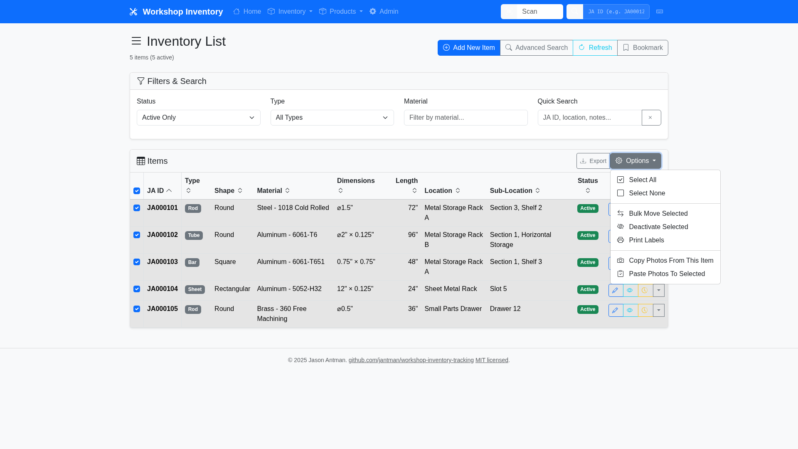
*Dropdown menu showing available bulk operations for selected items*

### Moving Items

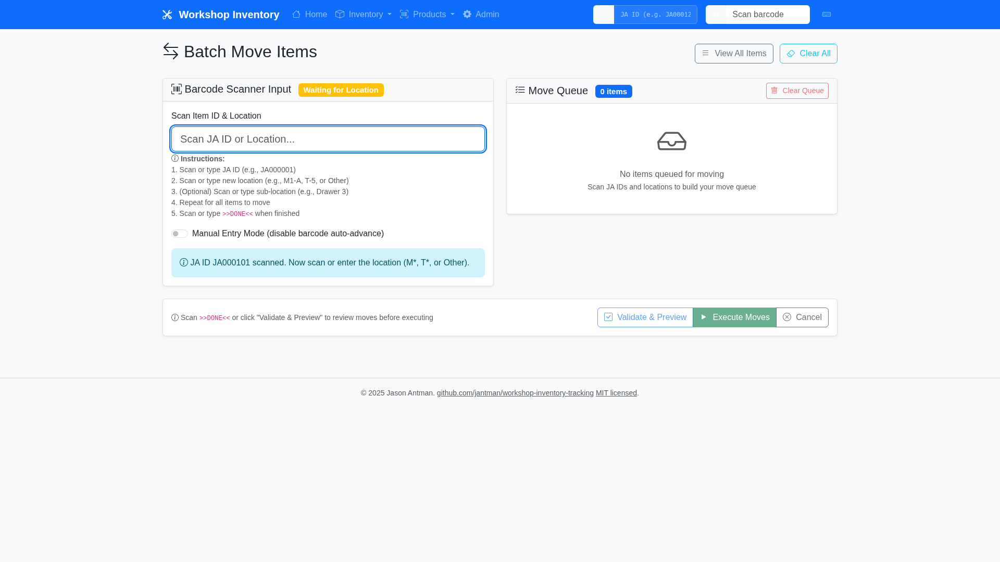
*Batch move interface for relocating multiple items efficiently*

The Move Items feature allows you to efficiently relocate multiple inventory items in a single batch operation. The system supports moving items to both primary locations and optional sub-locations.

There are two ways in: scan items on the Move Items page one at a time, or pick
them from a list first and let the page start with them already loaded.

#### Moving a Group of Selected Items

When a batch of items is all going to the same place — a shelf being cleared, a
bin being consolidated — pick them from a list and give the destination once
instead of scanning every item.

1. **Select the items**: On the Inventory List or the Advanced Search results,
   tick the checkbox on each item you want to move. "Select All" in the Options
   dropdown selects everything currently shown, so filtering or searching first
   is usually the quickest way to get the set you want.
2. **Options → Bulk Move Selected**: The Move Items page opens with those items
   already listed, showing each one's current location, and tells you how many
   are waiting for a destination.
3. **Scan the destination once**: Scan or type one location, and every selected
   item is queued for it. Nothing else is asked for.
4. **Sub-location (optional)**: Scan or type a sub-location next and it applies
   to **all** of the items you selected, not just the last one.
5. **Validate and execute**: Exactly as for scanned items — the two are the same
   thing once queued.

A few things worth knowing:

- **You can keep scanning.** After the group is queued the page returns to its
  normal behavior, so you can add more items by hand and move the whole batch
  together.
- **The destination is asked for first.** Until you give one, a JA ID or a
  sub-location is refused with an explanation — there is nothing yet for them to
  attach to.
- **Nothing is dropped silently.** If an item you selected has since been
  deleted, or is no longer the active row for its JA ID, it is named on screen
  with the reason and the rest of the selection proceeds without it.
- **Clearing the queue starts over.** The selection cannot be re-fetched by
  scanning another location, so clearing the queue returns the page to ordinary
  scanning.

An item's own row also has **Move** and **Shorten** actions in its dropdown
menu, which open the matching page with just that item already loaded. A single
item works exactly like a group of one.

#### Move Workflow

1. **Navigate**: Click "Move Items" in the main menu
2. **Scan Pattern**: Follow this sequence for each item:
   - **Scan JA ID**: Scan or enter the item's barcode (e.g., JA000123)
   - **Scan Location**: Scan or enter the new primary location (e.g., M1-A, T-5, Other)
   - **Scan Sub-Location** (optional): Scan or enter the sub-location (e.g., Bin-3, Shelf-B)
     - Sub-locations can be any text format
     - If no sub-location is needed, skip this step
   - **Next Item or Finalize**:
     - Scan the next item's JA ID to finalize the current move and start a new one
     - OR scan ">>DONE<<" to finalize the current move

3. **Review Queue**:
   - All queued moves appear in the table with item details
   - Each row shows: JA ID, current location, new location, and new sub-location (if specified)
   - Items remain in the queue until you execute the batch

4. **Validate Moves**:
   - Click "Validate & Preview" to check all queued moves
   - System verifies that all JA IDs exist in the database
   - Any issues are highlighted for correction

5. **Execute Moves**:
   - Click "Execute Moves" to apply all changes
   - Confirm the operation when prompted
   - All items are updated simultaneously
   - Success message confirms completion

#### Location Patterns

The system recognizes these location patterns:
- **M-locations**: M1, M2-B, M15-ZZ (materials storage)
- **T-locations**: T1, T-5, T10 (tool/temporary storage)
- **Other**: For non-standard locations
- **Sub-locations**: Any text format for specific bin, shelf, or section

#### Moving Without Sub-Location

When moving an item to a new location without specifying a sub-location, the system **clears any existing sub-location** for that item. This ensures location data stays clean and accurate.

**Example:**
- Item JA000100 is currently at "M1-A / Bin-3"
- You move it to "M2-B" (without specifying sub-location)
- Result: Item is now at "M2-B" with no sub-location (Bin-3 is cleared)

#### Workflow Examples

**Example 1: Simple Move (No Sub-Location)**
```
Scan: JA000100
Scan: M2-B
Scan: >>DONE<<
```
Result: JA000100 moved to M2-B (sub-location cleared if it had one)

**Example 2: Move with Sub-Location**
```
Scan: JA000200
Scan: M3-C
Scan: Shelf-A
Scan: >>DONE<<
```
Result: JA000200 moved to M3-C / Shelf-A

**Example 3: Batch Move Multiple Items**
```
Scan: JA000300
Scan: M4-D
Scan: Bin-1
Scan: JA000301      (this finalizes JA000300's move)
Scan: M4-D
Scan: Bin-2
Scan: JA000302      (this finalizes JA000301's move)
Scan: M5-E
Scan: >>DONE<<      (this finalizes JA000302's move)
```
Result: Three items moved - JA000300 to M4-D/Bin-1, JA000301 to M4-D/Bin-2, JA000302 to M5-E

#### Tips for Efficient Moving

- **Barcode Scanner**: Use a keyboard wedge barcode scanner for fastest data entry
- **Batch Related Items**: Group items going to the same location to minimize scanning
- **Review Before Execute**: Always validate the queue before executing to catch errors
- **Clear Sub-Locations**: When reorganizing, move items without sub-locations first to clear old data
- **Manual Entry Mode**: Check the "Manual Entry Mode" checkbox if you need to type values instead of scanning

### Shortening Items

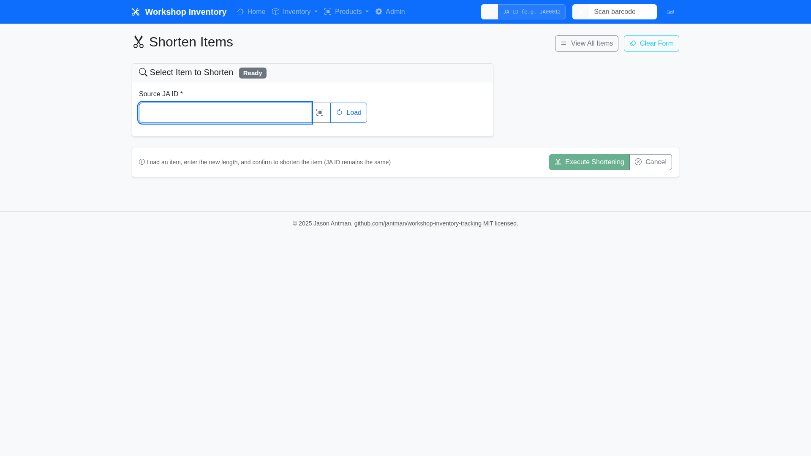
*Interface for cutting materials to length and creating child items*

1. **Navigate**: "Shorten Items" menu
2. **Item Selection**: Enter or scan item JA ID
3. **New Length**: Specify remaining length after cut
4. **New ID**: Assign new JA ID for shortened piece
5. **Automatic**: Original item becomes inactive, new item created

## The Product Catalog

The **inventory** side of this application tracks metal stock by JA ID. The
**product catalog** answers a different question: *what is this thing, what did
it cost, and where did it come from?* It exists because a part in a bin months
after purchase is unidentifiable without it, and reaching for a vendor page to
find out is the work this removes.

The two are separate. A product is a *kind* of thing you buy; an inventory item
is a specific piece of stock with a JA ID and a cutting history. Nothing in this
half touches the inventory tables.

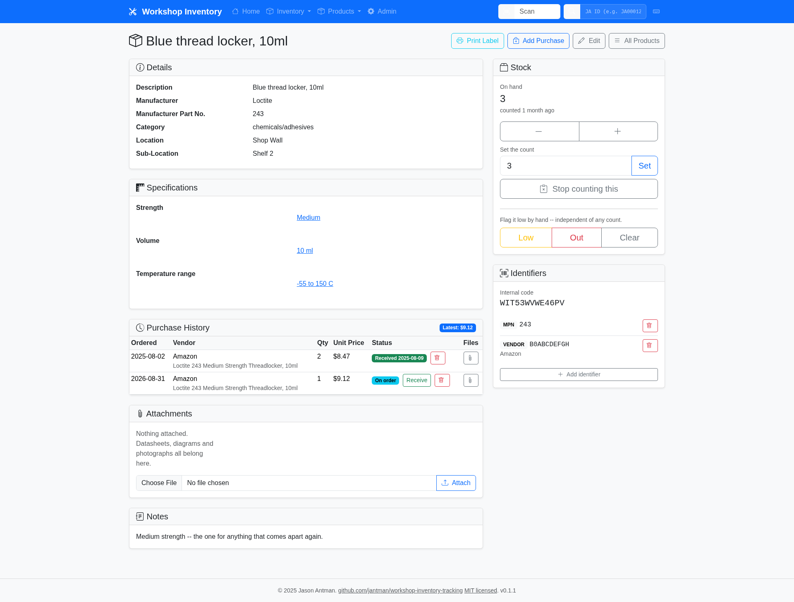
*A product page: what it is, what it cost, where it came from, and how many are on hand*

## Adding a Product

**Products → Add Product**, or scan something the catalog does not recognize
yet.

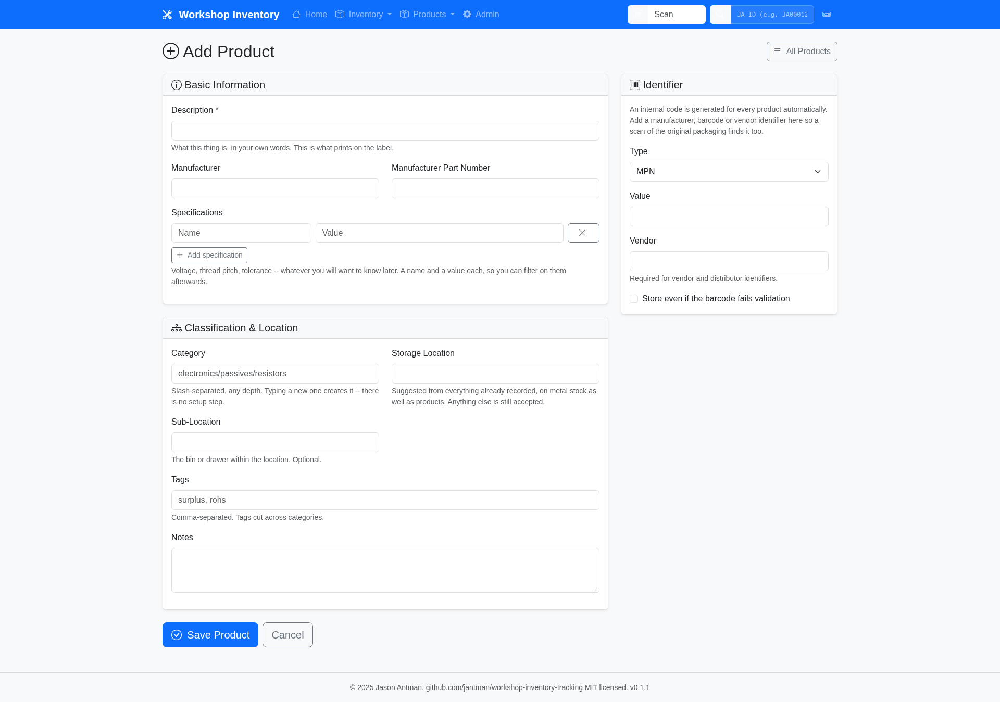
*The Add Product form -- only Description is required*

Only the description is required, and it is the most important field on the form:
it is what prints on the label, and it is what you will read when you pick the
bin up. Write it the way you would say it out loud.

- **Description** -- your own words. This is the product's identity.
- **Manufacturer / Manufacturer Part Number** -- optional.
- **Specifications** -- free-form. Voltage, thread pitch, tolerance; whatever you
  will want to know later. Nothing generates this for you.
- **Category** -- slash-separated: `electronics/dev boards/esp32 & esp8266`. The
  suggestions are the branches of the [category taxonomy](category-taxonomy.md),
  offered whether or not anything is filed in them yet, so you pick a branch
  rather than retyping one from memory. They are suggestions and not a
  whitelist: typing something the taxonomy does not name still works, and still
  creates it.
- **Tags** -- comma-separated, and they cut across categories.
- **Storage Location** -- optional, and free text. As you type, it suggests
  locations already recorded *anywhere* in the application -- on metal stock as
  well as on other products. The suggestions never restrict what you can type.
- **Sub-Location** -- optional. The bin or drawer within the location, the same
  way an inventory item records one. Its suggestions are scoped to whatever you
  put in Storage Location, so filling in `Drawer 3` first offers you the bins
  already used in `Drawer 3`. A product with no sub-location is perfectly
  ordinary -- products that predate this field simply have none.
- **Identifier** -- a manufacturer part number, a retail barcode, or a vendor's
  own item id. See [Product Identifiers](#product-identifiers).

Every product is given an **internal code** the moment it is created -- `WIT`
followed by ten characters. You do not type it and you cannot choose it. It is
what makes a product scannable before any label has been printed.

If the connection drops while you are part-way through writing a description, the
text is kept in the browser. Come back to the form and it offers to restore it.

## Product Identifiers

A product can carry any number of coded names, of five kinds:

| Kind | What it is |
|---|---|
| `INTERNAL` | This system's own code. Generated, never typed. |
| `MPN` | The manufacturer's part number. |
| `GTIN` | A retail barcode -- UPC-A, EAN-13, GTIN-8 or GTIN-14. |
| `VENDOR` | A vendor's own item id, such as an Amazon ASIN. |
| `DISTRIBUTOR` | A distributor's part number, such as a DigiKey number. |

**Barcodes are normalized on the way in.** A UPC-A and its EAN-13 rendering are
the same trade item, so both are stored as the same 14-digit key and both scan
back to the same product. You do not have to know or care which form the scanner
read.

A barcode that fails its check digit is refused, because a mistyped barcode that
silently "works" is worse than one that does not. If you know the value is right
anyway -- some vendors print odd ones -- tick **Store even if the barcode fails
validation** and it is kept, with the override recorded on the row so it is
visible later rather than silent. There is one exception with no override: a
barcode reading as all zeros is what a scanner emits when it fails to read
anything, so it is always refused. Rescan it.

**Vendor and distributor identifiers are scoped to their vendor.** An ASIN only
means anything within Amazon. If a vendor reuses an item id for a completely
different product -- and they do -- the catalog will not merge the two, because
a product's identity is its own record and never one of its names. You can delete
every identifier a product has and the product is still there.

## Scanning Products

There is a scan box in the header on every page, so a scan starts wherever you
already are. It also accepts typing, if you would rather.

A scan always gets an answer. There is no "not found":

| What you scanned | What happens |
|---|---|
| An internal code, or a barcode you have cataloged | The product opens |
| A manufacturer's own 2D barcode | Exactly as though you had scanned the plain barcode it carries |
| A valid barcode you have not cataloged | A create form, with the barcode already attached |
| A distributor's 2D label | A create form, filled in from the label |
| An ASIN you have recorded | The product opens |
| Anything else | A search, carrying what you scanned |

**A manufacturer's 2D code needs nothing from you.** Many boxes carry the retail
barcode a second time inside a square 2D symbol, wrapped up with a label saying
which number it is. Scan either mark and you land in the same place. If the same
symbol also carries a lot number or a date, those are ignored rather than
getting in the way. A number that fails its check digit is still refused here,
just as it is when printed plainly -- you get a search, not the wrong product.

Scanning a product you already hold offers **add a purchase to this product**, and
offers to receive any order you have outstanding for it -- because at the
receiving bench, the thing in your hand is usually the thing you just ordered.

### Distributor Labels

DigiKey and Mouser print a 2D label carrying the manufacturer part number, the
quantity and your order references. Scanning one produces a filled-in draft, with
**every value editable before you save** -- values are taken exactly as printed
and nothing is reformatted or rejected on your behalf.

If the label is damaged, or carries only fields this catalog has no home for,
you get a search with the raw scan shown rather than a silent failure. You can
always read it yourself and type what you need.

> This depends on the scanner passing through the field separators inside the
> label. If distributor scans suddenly come out as one run-together string, that
> is the setting to check.

## Recording Purchases

**Add Purchase** on a product records one acquisition: vendor, item id, listing
title, order date, quantity, unit price and order reference.

Leave **Received Date** blank while the order is still on its way. That blank is
the entire representation of "outstanding" -- there is no separate status to keep
in step with it.

Buying the same thing again adds a second purchase to the same product. It does
not create a duplicate. The product page shows the whole history oldest-first
with the most recent price called out.

## Which Vendors Are Supported

Three vendors are recognized by name, and anything else can still be cataloged
from its address. The four things below are genuinely different capabilities, and
which ones you get depends on where you are buying from:

| | **Amazon** | **DigiKey** | **McMaster-Carr** | **Anywhere else** |
|---|---|---|---|---|
| **A whole order at once** | Bookmarklet, on the order's own page in *Your Orders* | *Products → Capture a DigiKey Order*, by sales order number | Bookmarklet, on the order page | — |
| **One item, page read** | Yes — price, brand, description, *About this item*, every *Product information* row, every image the page names | No reader of its own; use the part lookup below, which brings back more | Yes — title, price, pack size, specifications, images | No reader of its own; the general reader runs and usually finds little |
| **One item, from the address** | Yes; the item id comes out of the `/dp/` path | Yes | Yes; the part number comes out of the path | Yes — the address, its title, and a vendor name |
| **Catalog detail filled in for you** | — | Yes — manufacturer, category, datasheet, photograph, parametric specifications | — | — |
| **Needs configuring first** | No | Yes — see below | No | No |

**A whole order at once** records every line of one order as an outstanding
purchase, in one action. See [Amazon Orders](#amazon-orders),
[DigiKey Orders](#digikey-orders) and
[McMaster-Carr Orders](#mcmaster-carr-orders).

**One item with the page read** is the bookmarklet on a listing: it reads what
the page states, so you get price and specifications rather than just a title.

**One item from the address** is the paste-a-URL form below, and it works for
anything at all. The vendor name is worked out from the site: Amazon, DigiKey,
Mouser, eBay, McMaster-Carr and AliExpress get their proper names, and every
other site becomes its own hostname. **That is all Mouser, eBay and AliExpress
get** — a tidier name, and no reading of the page whatsoever. They are not
supported vendors in the sense the other three are.

The page reader is written against Amazon's markup, and it is also what runs on a
site nobody wrote a reader for. So an unfamiliar site usually yields its title
and address and little else. That is not a failure — it is the honest result, and
the confirmation page tells you what it found before anything is recorded.

**Catalog detail filled in for you** is DigiKey's alone, and it happens in two
places: [cataloging a single part](#cataloging-a-single-part), where a part
number gets you a filled-in product; and on an order line that matched a product
you already hold, where the same detail fills that product's blanks. It only ever
fills blanks — anything you have set yourself is left as you set it.

**DigiKey is the only vendor that needs configuring.** Without credentials, its
two screens still open and say they are not configured, and nothing else changes:
Amazon and McMaster-Carr capture need nothing but the bookmarklet, because your
own browser does the reading. See
[DigiKey order capture and part lookup](deployment-guide.md#digikey-order-capture-and-part-lookup-optional)
in the deployment guide.

## Capturing an Order When You Place It

**Products → Capture an Order.** The point is to catch vendor, item id, title and
price while the listing is still on screen, so that nothing has to be
reconstructed at unboxing.

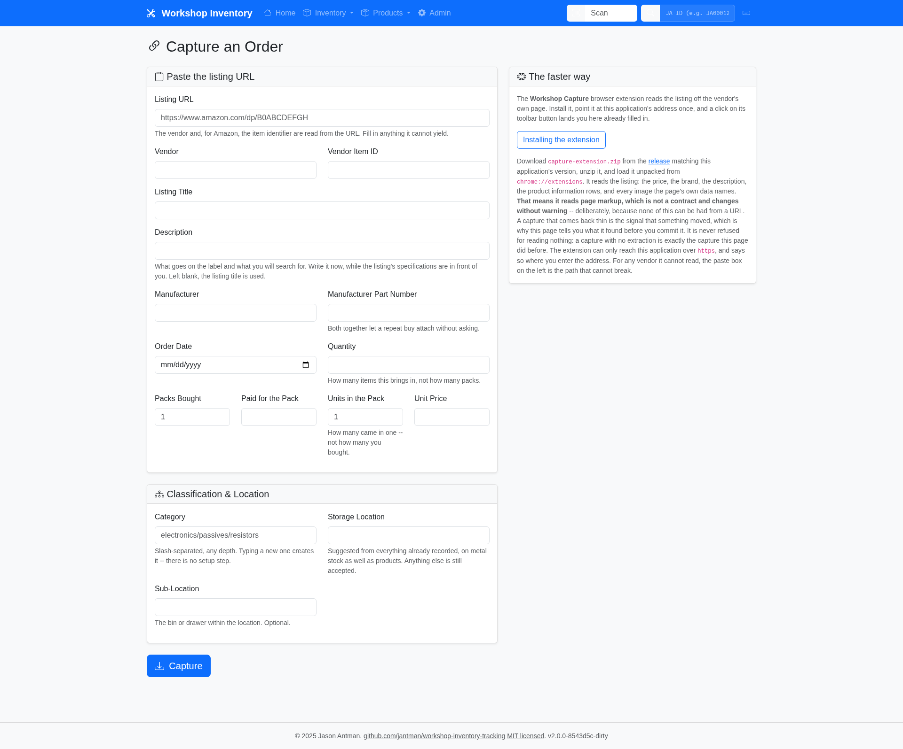
*Capturing an order: paste the listing URL, or use the bookmarklet. The warning on the right is what an `http://` page shows*

Two ways in:

1. **Paste the URL** into the form. The vendor comes from the address, and for
   Amazon the item id comes out of the `/dp/` path. Fill in anything the URL did
   not yield. This path cannot break when a vendor changes their site.
2. **The bookmarklet.** Drag *Capture to Workshop* to your bookmarks bar once. On
   a listing, click it: a new tab opens on this application's confirmation page,
   already filled in. It now reads the listing itself, not just the address --
   for an Amazon page that means the price, the brand, the description, the
   *About this item* bullets, every *Product information* row, and every image
   the page's own data names, which is usually more than the thumbnail strip
   shows.

   **The *About this item* bullets arrive as one specification row** of that
   name, one bullet to a line. Read them: on some listings that section is the
   only place the dimensions appear at all, and before this the capture skipped
   it entirely. The row is yours like any other -- edit it, delete it -- and
   capturing the same listing again neither adds a second copy nor writes over
   what you changed.

   **Manufacturer Part Number is filled from those rows too.** A row named
   *Manufacturer Part Number*, *Mfr Part Number*, *Part Number*, *Model Number*
   or *Item model number* fills the field, in that order of preference — the more
   specific name wins when a listing publishes several. It is a suggestion, not a
   finding: the last two are often a marketing model rather than an orderable
   part, so read it before you press Capture. Type over it or empty it and your
   version is what gets recorded, including if the capture comes back asking you
   a question first. The row itself stays in the specification list either way.

   What it reads is a page's markup, and a vendor's markup is not a contract. So
   the confirmation page tells you **what it found before anything is written** --
   a count of images, a count of information rows, and whether it found a
   description. A capture that comes back thinner than the listing looks is the
   signal that the vendor has changed something. The capture still works; it just
   brings less. Nothing is ever refused for this.

   Whatever it read is written when you press **Capture**, and not before. A full
   gallery takes eight to fifteen seconds to fetch at that point, which is
   expected -- the page is downloading a dozen full-resolution images.

> **The bookmarklet requires this application to be served over HTTPS**, and it
> must be dragged from the `https://` page. Two reasons, and both bite silently:
>
> - Amazon and most large vendors send an `upgrade-insecure-requests` policy that
>   rewrites every outgoing link from their page to `https://` — the
>   bookmarklet's included. Against a plain-`http://` server that arrives as a
>   TLS handshake and fails with `ERR_SSL_PROTOCOL_ERROR`.
> - The address the bookmarklet posts to is **baked in when the page renders**.
>   One saved from an `http://` page keeps pointing at `http://` no matter how
>   the application is served afterwards, and keeps failing. Re-drag it.
>
> If the capture page is showing a warning about this, you are viewing it over
> `http://` — open it over `https://` and drag the bookmarklet again. The paste
> box works either way.

### When it is sold as a pack

A listing that sells a 3-pack quotes one price, and that price is what the *pack*
cost. A purchase records what *one* costs. So the form asks for both: **Paid for
the Pack**, already filled in with the listing's price, and **Units in the Pack**.
Fill in the second and **Unit Price** works itself out.

It stays an ordinary field. Type over it if the listing was wrong about the price
or if something else was; what is in the field when you press **Capture** is what
gets recorded, whoever arrived at it.

**Units in the Pack is not Quantity.** It is how many came in one pack; Quantity
is how many units the order brings in. Neither pack field is stored — they exist
to work the unit price out and are forgotten the moment you capture.

A pack price rarely divides evenly. $17.99 across three is $5.996666…, and a price
is recorded to the cent, so the unit price is rounded — $6.00 here. Three of those
do not add back up to the $17.99 you paid, and the page says so beneath the field
rather than letting you discover it during a reconciliation months later.

### Filing it while you are there

The confirmation page also asks for **Category**, **Storage Location** and
**Sub-Location** -- the same three fields the product form has, offering the same
suggestions from everything already recorded, metal stock included. Nothing on a
vendor's page can say what kind of thing this is to *you*, or where it goes in
*your* shop, so these three are what a capture can never bring you; typing them
here is what saves opening the product afterwards to file it.

All three are optional and independent, and leaving them blank is an ordinary
outcome rather than an omission to come back to. The category suggestions are the
[taxonomy](category-taxonomy.md)'s branches, and a category you type does not
have to be among them -- or to exist first. Typing it is how it is created.

**On a capture that attaches to a product you already own**, a value you type
here *replaces* the one the product had: you are holding the thing and saying
where it goes now, which is better information than an older order's. Leaving a
field blank changes nothing -- blank means "I am not saying", never "erase it",
so there is no way to unfile a product from this page.

Capturing the same listing twice **asks** rather than guessing: it tells you a
purchase for this listing is already recorded today, and lets you say whether
this is a second order or a double-click. Nothing is written until you answer,
and answering costs nothing -- everything the listing yielded is still attached to
the form. A repeat capture adds no second copy of an image and does not overwrite
a specification you have edited by hand; it only adds what the product does not
already have.

**A captured barcode makes the product scannable.** When the listing publishes
one -- a `UPC`, `EAN`, `GTIN`, `ISBN`, `GTIN-13` or `UPC-A` row in its product
information -- the capture records it as the product's barcode as well as
keeping it in the specification list, so the code printed on the box finds the
product without anyone typing it in. The confirmation page says what became of
it, because three things can stop it:

- **The value is not a valid barcode.** A vendor's product table is typed by a
  person and read by a selector, and either can be wrong. A value that fails its
  check digit is kept as a specification and is never recorded as a barcode.
  There is no "store it anyway" here, deliberately -- you are not watching this
  happen, so nothing should record a barcode you have not seen.
- **Another product already has it.** Then nothing moves and nothing is
  duplicated; the page tells you which product holds it, and you decide.
- **The product already lists a row of that name.** Your row wins, as it does
  for every other specification -- so the captured one is not examined, and the
  page says so. This is the case to know about for products captured before this
  existed: re-capturing them does not add the barcode. Add it by hand from the
  product's **Identifiers** card, or delete the old row and capture again.

**An abandoned capture leaves nothing.** Close the confirmation tab without
pressing Capture and there is no product, no purchase, no specification and no
stored image -- there was never a record, only a page.

When the parcel arrives, open the purchase and **Mark Received**. The captured
details are already there; amend the quantity or the price if what turned up
differed from what you ordered, which it sometimes does.

## Amazon Orders

You usually order more than one thing at a time, and capturing an eleven-item
order one listing at a time means eleven trips back to pages you have already
left. **Open the order and click the bookmarklet once instead.**

### Capturing an order

Open the order in *Your Orders* so its own address is showing — the one ending
`/your-orders/order-details?orderID=...` — and click *Capture to Workshop*. A new
tab opens listing every item Amazon shows on that order: its title, how many were
ordered, what each cost, and whether this catalog already holds it.

**Nothing has been recorded at that point.** Write your own label description for
the items that are new, untick anything you do not want cataloged — a gift, a
consumable, a digital item — and confirm. One outstanding purchase is recorded
per line you kept, filed under the order number.

Clicking the bookmarklet on the *orders list* rather than on one order does not
work, and says so: there is no single order on that page.

**What you get is thinner than a listing capture, and the review says so.** An
order page states a title, a quantity and a price. The pictures, the
specifications, the *About this item* bullets and the barcodes all live on the
item's own listing page — one page per line — so an order capture does not fetch
them. To fill an item in later, capture its listing page the usual way: it
attaches to the same product rather than making a second one.

If Amazon changes their markup and a field stops reading, that field goes blank
and everything else still captures. The review marks what came back thin, and so
does the message after you confirm, so you know which records to look over.

### Seeing an order, and receiving the boxes

Open **Products → Captured Orders** and click through, or go straight to the
order. You get every line, its product, what you paid, whether it has arrived,
and a count of how many are still outstanding.

**Amazon receiving is done from that screen, not by scanning.** A DigiKey bag
names its order and its part, and a McMaster bag names its part — an Amazon box
names neither, and an item captured from an order page has no barcode recorded
for it either. So as each box arrives, open the order and receive the lines that
were in it. Amend the quantity if what turned up is short; confirming marks the
line received, raises the counted quantity and clears any low-stock flag, exactly
as receiving does anywhere else.

Where an item *does* carry a barcode this catalog knows — because you captured
its listing page at some point — scanning that barcode works too, and behaves the
way McMaster's does: one outstanding line goes straight to its receipt, several
ask you which.

## DigiKey Orders

A DigiKey order is not the shape the Amazon capture was built for. It is thirty
lines placed in one checkout, and it arrives weeks later as thirty anonymous bags
in one box. So DigiKey has its own path, and the unit of capture is the **order**
rather than the listing.

It reads your orders straight from DigiKey rather than off a web page, so nothing
here breaks when they redesign their site. Setting that up is a one-time job; see
**Setting up the DigiKey connection** at the end of this section.

### Capturing an order

**Products → Capture a DigiKey Order.** Type the sales order number from your
order confirmation — or read it off the `1K` field of a bag label — and press
**Look Up Order**.

You get every line of the order: the DigiKey part number, the manufacturer and
part number, the description, the quantity and what each cost. Alongside each
line, whether the catalog already holds it.

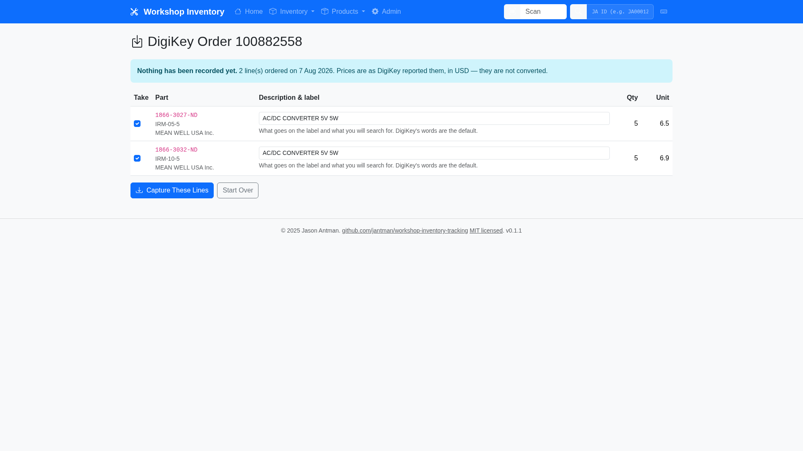
*Reviewing a DigiKey order before anything is written. Each line shows what the
order said and what DigiKey's part data added.*

**Nothing is recorded until you press Capture.** Close the tab and there is no
product and no purchase — there was never a record, only a page.

For each line you can:

- **Write the description.** For a line that will create a new product, this is
  what goes on the label and what you will search for. DigiKey's own words are
  the default; type over them.
- **Leave it out.** Untick a line and it produces nothing — a tool, a consumable,
  something you do not want cataloged.
- **Answer a question.** If a DigiKey part number already names a product whose
  manufacturer part number contradicts this line, you are asked whether it is the
  same thing. Nothing is written until you say. This is the rarest case and the
  most damaging one to get wrong, because nothing looks wrong afterwards — a
  product's price history quietly becomes the history of two different things.

Capturing records **one outstanding purchase per line**, so the reorder list stops
suggesting things that are already on the way.

**Each line is filled in from DigiKey's own part data** — the manufacturer, the
category and the full parametric detail as specification rows. A DigiKey order
line carries the manufacturer's part *number* but not their *name*, so that is
looked up separately for every line. A 24-line order therefore takes ten or
fifteen seconds to read, which is expected. If DigiKey will not answer for one
part, that line still captures with everything the order gave and the page says
which lines came back thin.

**Capturing the same order twice records nothing new.** A sales order number is
exact, so there is no guessing involved — unlike the Amazon capture, which has to
work out whether two clicks on the same day were one order or two.

**Re-capture an order that changed.** DigiKey splits a backorder or adjusts a
quantity; look the order up again and any new line is offered, a changed quantity
or price is shown against what you have with the option to apply it, and a line
the order no longer contains is reported rather than deleted.

### Receiving the box

The bags each carry a 2D label. Scan one in the header scan box and you land
**directly on the receipt for that line of that order** — the right product, the
right purchase, and the quantity the label says is in the bag rather than the
quantity that was ordered. Confirm, and it is received: the count goes up and any
manual low flag clears, exactly as receiving has always worked.

The label carries the sales order number and the DigiKey part number, which
together name exactly one line. Nothing has to be searched for.

- Scanning a bag whose line you have **already received** says so and receives
  nothing twice.
- Where the same part was ordered **twice on one order**, you are shown both and
  choose. The catalog does not pick one for you.
- A bag from an order you **never captured** behaves exactly as it did before:
  the product opens if you hold it, and a filled-in draft is offered if you do
  not.
- A label that **will not read** is no problem — open the order and receive that
  line by hand.

**Products → Capture a DigiKey Order** and then the order number, or any link
from a captured purchase, opens the order screen: every line, its state, and how
many are still outstanding. When the box is empty, what is still outstanding is
what DigiKey did not ship.

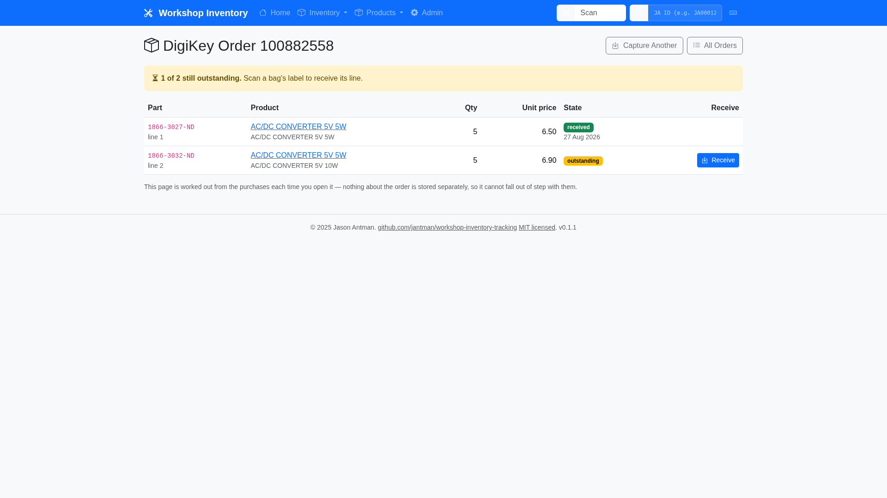
*A captured order part-way through unpacking: one line received, one still
outstanding.*

That screen is worked out from the purchases each time you open it. Nothing about
the order is stored separately, so it cannot fall out of step with them.

### Cataloging a single part

**Products → Capture a DigiKey Part.** Give it a DigiKey part number, a
manufacturer part number, or the address of a DigiKey product page, and you get a
filled-in product: manufacturer, both part numbers, the description, the
datasheet, the photograph, DigiKey's category and the part's full parametric
detail as specification rows.

Useful for cataloging something already on the shelf, and for anything you want
in the catalog before you order it. Write your own description over DigiKey's —
theirs is a default, not a decision, and it is kept in the specification rows
either way.

If you already hold the part, the page says which product it is rather than
inviting a second one. If DigiKey does not recognize the part number, it says so
plainly and offers the ordinary product form carrying what you typed.

**This also makes a scanned bag much richer.** A label for a part you do not hold,
from an order you did not capture, used to produce a draft carrying only the four
or five values printed on the label. It now brings DigiKey's description,
manufacturer, category and specifications too.

### Setting up the DigiKey connection

One-time, and done outside the application:

1. Sign in at `developer.digikey.com` and create a **Production App**.
2. Subscribe it to **Product Information** and **Order Status**. Do *not*
   subscribe to **Ordering** — this application never places orders, and that is
   the product that requires a DigiKey Credit account.
3. The portal asks for an OAuth callback URL. Use `https://localhost`. It must be
   `https://`, and it is never actually used.
4. Put the client id and secret in `.env`, along with your DigiKey **account
   number** — the one printed on any order confirmation or invoice:

   ```
   DIGIKEY_CLIENT_ID=...
   DIGIKEY_CLIENT_SECRET=...
   DIGIKEY_ACCOUNT_ID=...
   ```

   The account number is not a secret, but it is required. DigiKey's credentials
   identify the *application* rather than you, so the account has to be named
   separately — without it every order lookup fails.

5. Restart.

**Leaving it unset is fine.** The DigiKey screens say the connection is not set
up and point at this; everything else in the catalog works exactly as it does
now.

When something goes wrong, the page tells you which of five things it is —
not set up, credentials refused, no such order on this account, DigiKey
throttling requests, or DigiKey unreachable. They are worth distinguishing
because what you do about each is completely different. Nothing is ever
half-recorded: a capture that fails leaves the catalog exactly as it was, and you
can simply try again once the cause is fixed.

## McMaster-Carr Orders

A McMaster order has the same shape problem a DigiKey one does — a dozen or two
lines placed in one checkout, arriving as a box of anonymous bags — but the
opposite premise. **There is no API to read it from.** McMaster's requires an
application review a one-person workshop will not pass, so the order is read off
the page you are looking at, by the same capture bookmarklet you use on Amazon.

**Nothing needs setting up.** Unlike DigiKey, there is no account to register, no
key to paste and no connection to configure. The bookmarklet carries your own
signed-in session, which is why it can see an order page at all.

### Capturing an order

Open one order from **Order History** on McMaster's site, so that order's own
address is showing, and click the capture bookmarklet. A tab opens here with
every line of the order in it.

Each line shows what McMaster said — the part number, their description, how many
packs, what a pack holds and what a pack cost — and, next to it, what this
catalog will actually record: **units and a unit price**. Both of those are
editable. Individual screws are what you consume and what a low-stock flag has to
mean, so a line reading "2 packs of 100 at $6.00" is recorded as 200 at $0.03.

Alongside each line, whether the catalog already holds it:

- **Nothing matches.** Write the label description you want — what goes on the
  label and what you will search for. McMaster's words are the default.
- **Already in the catalog.** The purchase attaches to the product you already
  have.
- **Already captured.** This line was recorded by an earlier capture of the same
  order. Nothing is written again. If the quantity or price has changed since,
  you are shown both and asked whether to update it.

Untick any line you do not want. An excluded line becomes nothing at all — no
product, no purchase, and no record that you skipped it.

**Nothing is written until you press Capture These Lines.** Close the tab and
there is no trace, because there was never a record — only a page.

### What you get

One outstanding purchase per line you took, each carrying the McMaster part
number, the order, which line of it, the quantity in units, the unit price and
the date. Each new product carries its McMaster part number as a distributor
identifier, so scanning or searching that number finds it.

**No manufacturer part number is invented.** McMaster sells to its own
specification and names no manufacturer on most of what they sell, so that field
is left empty rather than filled with a guess.

### Which order is which

**McMaster does not show an order number.** What identifies an order is the
**Purchase Order** name — the one you type at checkout, or the one they generate
from the date and your surname if you do not. That name is what this catalog
files the order under, and what you type to find it again.

That name is editable on McMaster's site. Renaming it there does not rename what
is already recorded here, so an order you captured will still be under its old
name. Captures are matched to each other by McMaster's own internal order id as
well, so re-capturing a renamed order still recognizes what it already has.

### Seeing an order, and receiving the box

Open **Products → McMaster-Carr Order** and type the Purchase Order name, or
follow the link after a capture. You get every line, its product, what you paid
and whether it has arrived, plus a count of how many are still outstanding.

When the box turns up, **scan the part number off a bag**. You land on that
line's receipt with the quantity already filled in — amend it if what arrived is
short — and confirming marks the line received, raises the counted quantity and
clears any low-stock flag.

Where the same part is outstanding on **two** orders, nothing about the bag says
which one it is, so you are asked to pick. The two can have been placed weeks
apart, so there is no single order screen that could show you both.

Scanning a part number with no outstanding line does what it has always done: it
opens the product. Nothing is ever received twice by scanning it twice.

### Capturing a single part

The same bookmarklet works on a McMaster **product** page. The confirmation form
arrives carrying the part number, McMaster's description, the price, what a pack
holds, the specification table and the product image, with nothing typed. Write
your own label description over McMaster's — theirs is kept alongside — and
capture it.

Pasting a McMaster product address into **Products → Capture** does the same
thing without the bookmarklet, reading the part number out of the address.

### When the page does not give it up

McMaster's markup is not a contract, and this reads their markup. When they
change it, a capture loses fields rather than failing — and **it tells you which
ones**.

- A line whose price could not be read shows the price blank, editable, and
  marked as unread. The rest of the line still captures.
- If fewer lines could be read than were on the page, the review says so
  plainly: "Only 3 of the 14 line(s) on that page could be read." Those lines are
  not captured, and you are told to check the order and add anything missing.
- If no line could be read at all, you get a plain statement saying so rather
  than an empty review that would look like an order with no lines.

The flash after a capture repeats which lines came back thin, so the record of it
survives leaving the review page.

## Printing Product Labels

These are the catalog's labels, carrying a product's internal code. For the
JA ID labels that go on inventory items, see [Label Printing](#label-printing).

**Print Label** on a product composes a label carrying three things:

- the description,
- where it came from and what it cost, when there is a purchase to say so,
- the internal code, as a barcode **and** as readable text.

Both forms of the code are always present. Direct-thermal labels scuff on a
workshop shelf, and the readable code is what keeps a label with a damaged
barcode usable -- so it is never dropped to make room. On a narrow label the
description is shortened instead.

All six label stocks are available, the same set the inventory labels use. On the
1x2 stock the description will often be truncated; that is the trade-off, and it
is why you choose the stock at print time.

Reprinting takes two clicks and no typing. The label is composed from the record
each time rather than stored, so a reprint after you have improved the
description shows the improved one.

## Captured Orders

**Products → Captured Orders** answers the question the rest of this chapter
cannot: *what is still on its way, from anyone?*

Every order you have captured, from every vendor, most recent first — with its
date, how many lines it has and how many are still outstanding. An order with
nothing left outstanding is marked as complete, so a glance is enough to tell
what is still arriving from what has landed.

It is worked out from the purchases each time you open it. There is no separate
record of an order anywhere in this application: an order *is* the purchases
carrying its number, which is why the list cannot fall out of step with them.

## Stock Levels and Reordering

Quantity is deliberately **three-state**, and the three are shown differently
everywhere:

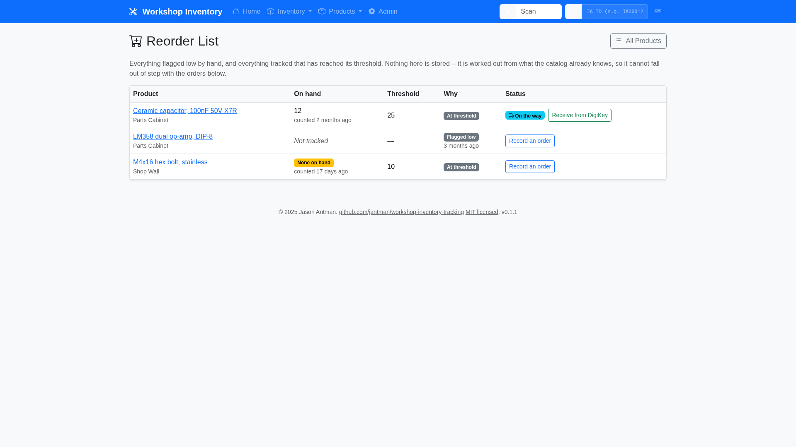
*The reorder list: one row reached its threshold, one was flagged by hand three months ago, one has none on hand, and one is already on the way*

| State | Means | Shown as |
|---|---|---|
| Not tracked | You are not counting these | *Not tracked* |
| `0` | You are counting, and there are none | **None on hand** |
| A number | That many | the number |

New products are not tracked. Most things never need to be -- start counting only
the handful where running out costs you something.

Where a quantity is tracked, it is always shown with its age: *counted 8 months
ago*. A count nobody has revisited in eight months is not a fact about today, and
showing the age lets you decide how much to trust it. The age means **the last
time you counted** -- typing a number, or pressing **+** or **−** at the shelf.
Receiving an order adds to the count without touching the age, because a packing
slip is not you looking in the drawer.

A hand-set **Low** or **Out** flag is shown with its age the same way: *Flagged
low 3 months ago*, on the product page and on the reorder list. Pressing the same
flag again resets its age -- that is you saying you have just looked and it is
still low, which is the only way to renew the evidence on something you are not
counting.

Flags you set before this was added have no recorded date, and read *Flagged low
at an unknown time*. That is not an error: no date was kept at the time, and
inventing one from something else would be a guess dressed up as a fact. Press
the flag again to give it a real date.

**Products → Reorder List** gathers everything that needs buying:

- anything you flagged **Low** or **Out** by hand, and
- anything tracked that has reached its reorder threshold.

Items with an order already outstanding are marked **on the way**, worked out
from the orders themselves -- you never record that separately. Nothing on this
page is stored; it is all derived when you open it, so it cannot drift out of
step with your purchases.

Receiving an order clears both kinds of low: the count goes up, and a manual flag
is cleared for you -- along with the flag's age, so a flag you set later never
inherits an old date. What receiving deliberately leaves alone is the *count's*
age: the number accounts for the delivery, and the date beside it still tells you
when you last counted. What the delivery changed is on the purchase that changed
it.

All of these controls are buttons, not typing, so the whole flow works on a
handheld with no keyboard.

## Product Attachments

Products and purchases both take attachments -- images and PDFs, up to 20 MB.

A **datasheet or wiring diagram belongs to the product**. A **saved listing or
receipt belongs to the purchase** that captured it. Attach them where they
belong; PDFs get thumbnails like everywhere else in the application.

A product's attachments show as a **grid of thumbnails** -- a captured gallery is
a dozen images with derived filenames, and a list of those is not something
anyone can look through. Click one for the original. A product holds up to 100.

**Copy an image anywhere and paste it on a product page** to attach it, with no
file to save first. Pasting ordinary text does nothing and says nothing.

**Removing several at once.** Capture reads the page's markup, and markup
changes without warning, so a capture that brings in a dozen of the vendor's
*other* products is a normal outcome rather than a fault. Tick the ones you do
not want and press **Delete Selected** -- one confirmation, naming how many are
going, and they all go. **Select all** takes the whole grid, so clearing a
capture that got nothing right is three actions: select all, delete, confirm.

The trash button on a single thumbnail still removes just that one, and still
asks nothing first.

## Finding Products

**Products → All Products** searches descriptions, specifications, part numbers,
notes and every recorded identifier at once, including internal codes. Notes are
searched on the same terms as everything else, so a phrase you wrote in your own
words -- *left over from the lathe stand* -- finds the thing you wrote it about
without your having to remember which field you put it in.

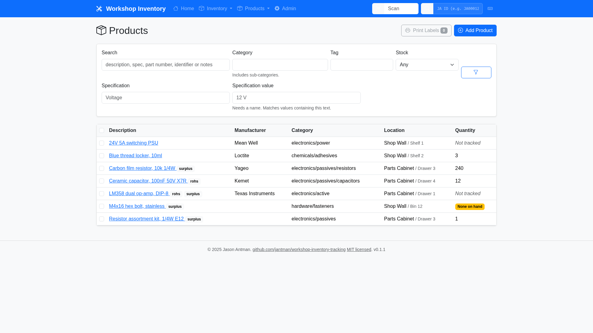
*The product list, with the filter bar above it and all three quantity states visible at once*

**A product's code is also its address.** The code printed on a label works on
the end of the address bar: type `/products/WIT…` and you land on that product.
Handy when the label is in front of you and the scanner is not.

Filters, which combine:

- **Category** -- includes sub-categories. Filtering `electronics` finds
  `electronics/passives/resistors`, and does not find `electronics-surplus`.
- **Tag** -- ignores category entirely.
- **Stock** -- low, on order, tracked, not tracked, none on hand.

To browse the category and tag trees rather than search across them, see
[Categories and Tags](#categories-and-tags).

## Categories and Tags

**Products → Categories** browses the tree with a count against each. The rows
come from two places: the branches of the [category taxonomy](category-taxonomy.md),
and any category a product carries that the taxonomy does not name. The shipped
taxonomy is one workshop's and a deployment can replace it with its own -- see the
[deployment guide](deployment-guide.md#1-environment-variables) -- so the branches
you see may not be the ones documented there.

A branch showing a count of **0** holds nothing *directly*. It may still have
products further down: the count on each row is that row's own, so a parent
whose children hold everything reads 0 and is entirely normal.

A branch with nothing beneath it either carries no **Rename** button. There is no
row anywhere to rewrite, so such a branch exists only in the taxonomy record and
is renamed by editing `docs/category-taxonomy.md`. A parent with occupied
children keeps its button and renames like any other. A row marked *not in the record* is
one somebody typed on a product; it is perfectly legitimate, and the mark is
there so the divergence between the record and what your products actually carry
is visible rather than silent.

Categories the taxonomy does not name still work the old way: such a category
exists because something is in it, and moving the last product out removes it.

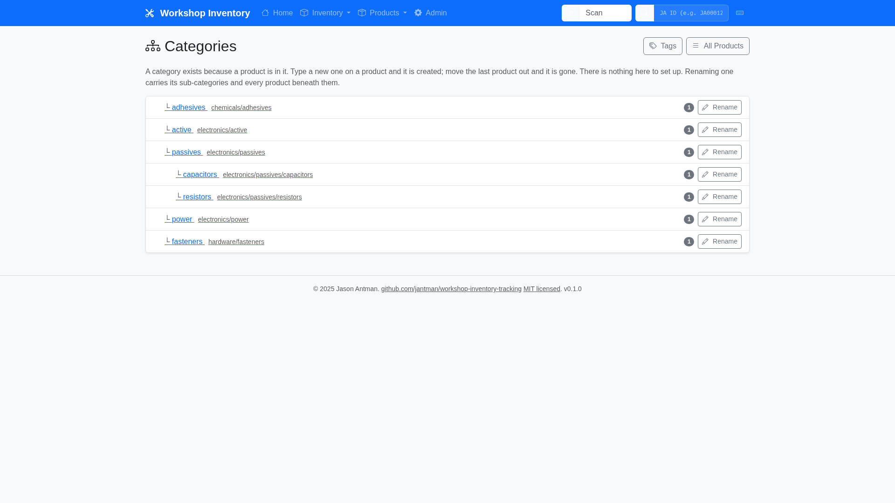
*The category tree: branches on offer at a count of zero, and a typed category
marked "not in the record"*

**Products → Tags** is the same view for tags: every tag in use, with how many
products carry it. Unlike categories, a tag with nothing on it survives, and it
is shown here with a count of zero -- that is the debris the page exists to
reveal.

The tags page has a **Rename** button on every row. The categories page has one
on every row with products in it, for the reason above.

**Renaming a category carries everything beneath it.** Renaming `elctronics` to
`electronics` moves `elctronics/passives` and
`elctronics/passives/resistors` with it, along with every product in any of them
-- one action, not one edit per product. The boundary is the slash, so
`elctronics-surplus` is a *different* category and is left alone. The dialog
tells you how many products and how many categories will move before you commit.

Renaming is refused, with nothing changed, when:

| You try | What happens |
|---|---|
| Renaming onto a category that already exists | Refused, naming the collision. Renaming never merges two categories. |
| Renaming a category to somewhere inside itself (`power` → `power/supplies`) | Refused. |
| Changing only capitalization or spacing | Refused as a no-op -- those never distinguished two categories in the first place. |
| A name so long it would overflow a path beneath it | Refused. Nothing is silently truncated. |

A refusal is all-or-nothing: not one product moves.

**Renaming a tag onto a name already in use merges the two.** The dialog says so
before you commit. Afterwards one tag remains carrying both sets of products, and
a product that happened to carry both spellings carries the survivor exactly
once. Renaming onto an unused name is a plain rename. Tags are stored lowercase,
so renaming `Surplus` to `surplus` is a no-op and is refused as one.

Neither rename leaves a forwarding address. An old bookmark to a renamed category
or tag simply stops matching.

## Locations and Vendors: One Shared Vocabulary

Storage locations, sub-locations and vendors are suggested from everything
already recorded, on both halves of the application:

| Field | Drawn from |
|---|---|
| Storage Location | inventory items and products |
| Sub-Location | inventory items and products, scoped by the location you typed |
| Vendor | inventory items and purchases |

There is nothing to publish and nothing to keep in sync -- record `Drawer 3` on a
product and the Add Item form offers it immediately, and vice versa. A vendor
recorded only on a *deactivated* item is still offered; deactivating a piece of
stock does not retire the vendor's name. Two spellings differing only in case
count as one suggestion.

The suggestions are advisory. Every one of these fields is plain text, and typing
something that matches nothing saves exactly as typed.

Thread Size and Purchase Location are inventory-only fields and are unchanged --
nothing in the catalog records either.

## Data Export

The system provides comprehensive data export functionality to backup your inventory data and materials taxonomy to Google Sheets or download as JSON data. This feature is essential for data backup, reporting, and integration with other systems.

### Export Types

#### 1. Inventory Export
Exports all inventory items with complete details including:
- Item identification (JA ID, type, shape, material)
- Physical dimensions (length, width, thickness, wall thickness, weight)
- Threading information (series, handedness, size, form)
- Location tracking (location, sub-location)
- Purchase details (date, price, vendor, part numbers)
- Status and history (active/inactive, dates, notes)

#### 2. Materials Taxonomy Export
Exports the hierarchical materials classification system:
- Material names and categories
- Hierarchy levels (1=Category, 2=Family, 3=Material)
- Parent-child relationships
- Example: Metal → Steel → 4140 Pre-Hard

#### 3. Combined Export
Exports both inventory and materials data in a single operation for complete backup.

### Export Destinations

#### JSON Format
- **Use Case**: API integration, data processing, development
- **Format**: Structured JSON with metadata, headers, and row data
- **Response**: Direct API response with immediate download
- **Benefits**: Machine-readable, preserves data types, includes export metadata

#### Google Sheets Upload
- **Use Case**: Backup, manual review, sharing with stakeholders
- **Format**: Direct upload to Google Sheets with proper formatting
- **Target Sheets**: `Metal_Export` (inventory), `Materials_Export` (materials)
- **Benefits**: Human-readable, accessible via web browser, collaborative editing

### Using the Web Interface

#### Admin Export Page
1. Navigate to `/admin/export` (admin access required)
2. Select export type: Inventory, Materials, or Combined
3. Choose destination: JSON Download or Google Sheets Upload
4. Configure options:
   - Include inactive items (inventory only)
   - Batch size for processing
   - Enable progress logging
5. Click "Export" to start the process
6. Monitor progress and download results

### API Access

#### Export to JSON
```bash
# Export inventory data only
curl -X POST http://localhost:5000/api/admin/export \
  -H "Content-Type: application/json" \
  -d '{
    "type": "inventory",
    "destination": "json",
    "options": {
      "include_inactive": true,
      "batch_size": 1000
    }
  }' | jq '.'

# Export materials taxonomy only
curl -X POST http://localhost:5000/api/admin/export \
  -H "Content-Type: application/json" \
  -d '{
    "type": "materials",
    "destination": "json",
    "options": {
      "materials_active_only": true,
      "batch_size": 1000
    }
  }' | jq '.'

# Export combined data
curl -X POST http://localhost:5000/api/admin/export \
  -H "Content-Type: application/json" \
  -d '{
    "type": "combined",
    "destination": "json",
    "options": {
      "include_inactive": false,
      "materials_active_only": true,
      "batch_size": 1000
    }
  }' | jq '.'
```

#### Export to Google Sheets
```bash
# Upload inventory data to Google Sheets
curl -X POST http://localhost:5000/api/admin/export \
  -H "Content-Type: application/json" \
  -d '{
    "type": "inventory",
    "destination": "sheets",
    "options": {
      "include_inactive": true,
      "batch_size": 1000,
      "enable_progress_logging": true
    }
  }' | jq '.'

# Upload materials taxonomy to Google Sheets
curl -X POST http://localhost:5000/api/admin/export \
  -H "Content-Type: application/json" \
  -d '{
    "type": "materials", 
    "destination": "sheets",
    "options": {
      "materials_active_only": true,
      "batch_size": 1000
    }
  }' | jq '.'

# Upload both datasets to Google Sheets
curl -X POST http://localhost:5000/api/admin/export \
  -H "Content-Type: application/json" \
  -d '{
    "type": "combined",
    "destination": "sheets",
    "options": {
      "include_inactive": false,
      "materials_active_only": true,
      "batch_size": 1000,
      "enable_progress_logging": true
    }
  }' | jq '.'
```

#### Data Validation
```bash
# Validate export data before uploading
curl -X POST http://localhost:5000/api/admin/export/validate \
  -H "Content-Type: application/json" \
  -d '{
    "export_data": {
      "inventory": {
        "headers": ["Active", "JA ID", "Length", "..."],
        "rows": [["Yes", "JA000001", "5.5400", "..."]]
      },
      "materials": {
        "headers": ["Name", "Level", "Parent"],
        "rows": [["Steel", "2", "Metal"]]
      }
    }
  }' | jq '.'
```

### Export Options

#### Inventory Options
- **include_inactive**: Include inactive/historical items (default: true)
- **inventory_sort_order**: Sort order for results (default: "ja_id, active DESC, date_added")
- **batch_size**: Records per processing batch (default: 1000)

#### Materials Options  
- **materials_active_only**: Export only active materials (default: true)
- **materials_sort_order**: Sort order (default: "level, sort_order, name")
- **batch_size**: Records per processing batch (default: 1000)

#### General Options
- **enable_progress_logging**: Show detailed progress logs (default: true)
- **export_generated_by**: Attribution text for export metadata

### Response Format

#### Success Response (JSON)
```json
{
  "success": true,
  "export_data": {
    "type": "inventory",
    "headers": ["Active", "JA ID", "Length", "..."],
    "rows": [
      ["Yes", "JA000001", "5.5400", "..."],
      ["No", "JA000002", "3.2500", "..."]
    ],
    "metadata": {
      "export_type": "inventory",
      "timestamp": "2025-09-11T17:30:00.000Z",
      "records_exported": 476,
      "success": true,
      "errors": [],
      "warnings": []
    }
  },
  "export_type": "inventory",
  "timestamp": "2025-09-11T17:30:00.000Z"
}
```

#### Success Response (Google Sheets)
```json
{
  "success": true,
  "message": "Export to Google Sheets completed successfully",
  "export_type": "inventory",
  "upload_details": {
    "success": true,
    "rows_uploaded": 476,
    "sheets_updated": ["Metal_Export"],
    "upload_type": "inventory"
  }
}
```

#### Error Response
```json
{
  "success": false,
  "error": "Export operation failed: Invalid export type"
}
```

### Automated Backups

#### Scheduled Exports via Cron
```bash
# Daily backup at 2 AM - inventory and materials to Google Sheets
0 2 * * * curl -X POST http://localhost:5000/api/admin/export \
  -H "Content-Type: application/json" \
  -d '{"type": "combined", "destination": "sheets", "options": {"include_inactive": true}}'

# Weekly backup to JSON files  
0 3 * * 0 curl -X POST http://localhost:5000/api/admin/export \
  -H "Content-Type: application/json" \
  -d '{"type": "combined", "destination": "json"}' \
  > "/backups/inventory_$(date +%Y%m%d).json"
```

### Best Practices

#### Performance
- Use appropriate batch sizes (1000 is optimal for most cases)
- Schedule large exports during low-usage periods
- Enable progress logging for monitoring long-running exports

#### Data Quality
- Validate exports regularly using the validation endpoint
- Compare record counts between source and destination
- Review export metadata for errors and warnings

#### Security
- Restrict admin export access to authorized users only
- Use HTTPS for all API communications
- Rotate Google Sheets credentials regularly
- Monitor export logs for unusual activity

#### Backup Strategy
- Regular automated backups to Google Sheets for accessibility
- Periodic JSON exports for long-term archival
- Test restore procedures using exported data
- Keep multiple backup versions for point-in-time recovery

### Troubleshooting Export Issues

#### Common Problems
- **"Google Sheets connection failed"**: Check credentials and sheet permissions
- **"Sheet not found"**: Ensure target sheets exist in the Google Sheets document
- **"Rate limit exceeded"**: Reduce batch size or add delays between operations
- **"Export timeout"**: Break large exports into smaller chunks or increase timeout

#### Performance Tuning
- Adjust batch_size based on dataset size and performance
- Use include_inactive=false for faster inventory exports
- Monitor system resources during large exports
- Consider off-peak hours for major backup operations

## REST API

The application exposes a small set of JSON endpoints intended for
programmatic clients (scripts, integrations, or the bundled Python
client described below). The endpoints are served from the same Flask
application as the web UI and share its database. They are exempt from
CSRF and have no built-in authentication; protect them at the network
layer if exposed beyond the local host.

### `POST /api/inventory/items`

Create one or more inventory items.

Request body: a JSON object. Unknown top-level keys are rejected with
a 400 so typos surface immediately. **The server allocates JA IDs
itself — do not send a `ja_id` field. Sending one is treated as an
unknown field and the request is rejected with 400.** The allocated
JA ID(s) come back in the response's `created_ja_ids` list.

The full set of accepted fields follows.

#### Required fields

| Field       | Type   | Description |
|-------------|--------|-------------|
| `item_type` | string | One of: `"Bar"`, `"Plate"`, `"Sheet"`, `"Tube"`, `"Threaded Rod"`, `"Angle"`, `"Channel"`. |
| `shape`     | string | One of: `"Rectangular"`, `"Round"`, `"Square"`, `"Hex"`. |
| `material`  | string | Material name. Validated against the materials taxonomy when one is configured; pass a name or alias from the taxonomy (e.g. `"Steel"`, `"4140"`, `"6061-T6"`, `"316"`). When the taxonomy is empty the field is accepted as-is. |
| `location`  | string | Physical location label (e.g. `"Shelf A"`). Free-form. |

#### Dimension fields (inches, except `weight` in pounds)

| Field            | Type             | Description |
|------------------|------------------|-------------|
| `length`         | string \| number | Length in inches. Strings may be decimal (`"12.5"`), simple fraction (`"3/4"`), or mixed number (`"1 1/2"`). Numbers are coerced to string before parsing. |
| `width`          | string \| number | Width in inches — **the diameter for any round item**. Same parsing rules as `length`. |
| `thickness`      | string \| number | Thickness in inches. Same parsing rules. |
| `wall_thickness` | string \| number | Wall thickness for tubular shapes, in inches. Same parsing rules. |
| `weight`         | string \| number | Weight in pounds. Always optional. |

Which of these are required depends on the item's type and shape — the
same rule the Add Item and Edit Item forms apply. A request missing one
returns 400 naming **every** dimension that is missing, so correcting one
omission does not reveal the next.

| Type           | Shape                         | Required |
|----------------|-------------------------------|----------|
| `Bar`          | `Rectangular`                 | `length`, `width`, `thickness` |
| `Bar`          | `Round`, `Square`, `Hex`      | `length`, `width` |
| `Plate`        | `Rectangular`, `Square`       | `length`, `width`, `thickness` |
| `Plate`        | `Round`                       | `width` (diameter), `thickness` — **no length** |
| `Sheet`        | `Rectangular`, `Square`       | `length`, `width`, `thickness` |
| `Sheet`        | `Round`                       | `width` (diameter), `thickness` — **no length** |
| `Tube`         | `Round`, `Square`, `Rectangular` | `length`, `width`, `wall_thickness` |
| `Threaded Rod` | `Round`                       | `length`, `thread_series`, `thread_size` |
| `Angle`        | `Rectangular`                 | `length`, `width`, `thickness` |
| `Channel`      | `Rectangular`, `Square`       | *(none)* |

A round plate or sheet is a disc, described by its diameter and its
thickness; a length is accepted and preserved if you send one, but is
never asked for.

```json
{
  "success": false,
  "error": "Missing required field(s) for Plate/Round: Diameter, Thickness"
}
```

An unparseable dimension (e.g. `"abc"`) returns 400 with the field
name in the error message.

#### Optional threading fields

| Field               | Type   | Description |
|---------------------|--------|-------------|
| `thread_series`     | string | One of: `"UNC"`, `"UNF"`, `"UNEF"`, `"UNS"`, `"Metric"`, `"BSW"`, `"BSF"`, `"NPT"`, `"Acme"`, `"Trapezoidal"`, `"Square"`, `"Buttress"`, `"Custom"`, `"Other"`. Case-insensitive (uppercased before storage). The literal string `"None"` is treated as not provided, matching the HTML form. |
| `thread_handedness` | string | `"RH"` (right-hand, the default if `thread_series` is set) or `"LH"` (left-hand). Case-insensitive. |
| `thread_size`       | string | Thread designation, e.g. `"1/4-20"`, `"M10x1.5"`, `"3/8-16"`. |

#### Optional location, purchase, and metadata fields

| Field                | Type             | Description |
|----------------------|------------------|-------------|
| `sub_location`       | string           | Sub-location within the primary location. |
| `purchase_date`      | string           | Date the item was purchased. Accepts ISO `YYYY-MM-DD`, US `MM/DD/YYYY`, or dotted `MM.DD.YYYY`. Unparseable values are silently stored as null (matching form behavior). |
| `purchase_price`     | string \| number | Purchase price. Stored as-supplied. |
| `purchase_location`  | string           | Where the item was purchased (vendor location, store name, etc.). |
| `vendor`             | string           | Vendor name. |
| `vendor_part_number` | string           | Vendor's part number. (This is the JSON field name; it is stored internally as `vendor_part`.) |
| `notes`              | string           | Free-form notes. |

#### Optional flags

| Field       | Type    | Description |
|-------------|---------|-------------|
| `active`    | boolean | Whether the item is active. **JSON booleans only** (`true` / `false`); string values like `"on"`, `"true"`, `"yes"` are rejected with a 400. Defaults to `false` when omitted, matching the HTML form's unchecked-checkbox semantics — pass `true` explicitly to create an active item. |
| `precision` | boolean | Whether the item carries precision dimensions. Same rules as `active`. Defaults to `false`. |

#### Bulk creation

| Field                | Type    | Description |
|----------------------|---------|-------------|
| `quantity_to_create` | integer | Number of items to create with sequential JA IDs (1-100). Defaults to 1. The server allocates the next free JA ID and assigns it to the first item, then increments for each subsequent item. The provided field values are applied to every created item. |

#### Response

Always JSON:

```json
{
  "success": true,
  "created_ja_ids": ["JA000123"],
  "errors": [],
  "message": "Item added successfully"
}
```

Each entry in `errors` has the shape
`{"index": <1-based attempt position>, "ja_id": <the JA ID that was attempted, may be null>, "message": "..."}`.
The `index` is 1-based — `index: 2` means "the second item the bulk
request tried to create." For single-item requests it is `0`.

#### Status codes

- `200 OK` — all requested items were created.
- `207 Multi-Status` — bulk request succeeded for some items but not
  all. `created_ja_ids` lists the ones that persisted; `errors` lists
  the failures.
- `400 Bad Request` — request-level validation problem: missing
  required field, unknown JSON key, malformed body, invalid enum
  value, unparseable dimension, invalid material, etc. Nothing was
  created. Also returned when every item in a bulk request failed
  for a parse-time validation reason.
- `500 Internal Server Error` — unexpected backend failure (e.g. DB
  unreachable). Nothing was created (or, in a bulk request, no items
  succeeded and at least one failure was a non-validation error).

#### Example: minimal single-item request

Request:

```json
{
  "item_type": "Bar",
  "shape": "Round",
  "material": "Steel",
  "location": "Shelf A",
  "active": true
}
```

Response (the JA ID was allocated by the server):

```json
{
  "success": true,
  "created_ja_ids": ["JA000123"],
  "errors": [],
  "message": "Item added successfully"
}
```

#### Example: fully-populated bulk request

```json
{
  "item_type": "Threaded Rod",
  "shape": "Round",
  "material": "316",
  "location": "Rack 3",
  "sub_location": "Bin 7",
  "length": "36",
  "width": "1/4",
  "thread_series": "UNC",
  "thread_handedness": "RH",
  "thread_size": "1/4-20",
  "purchase_date": "2024-09-15",
  "purchase_price": "8.95",
  "purchase_location": "McMaster-Carr",
  "vendor": "McMaster-Carr",
  "vendor_part_number": "98990A030",
  "notes": "Stocked for fixture builds.",
  "active": true,
  "precision": false,
  "quantity_to_create": 5
}
```

The five JA IDs the server allocates are returned in
`created_ja_ids` (e.g. `["JA000200", "JA000201", "JA000202",
"JA000203", "JA000204"]`).

### `POST /api/items/<ja_id>/photos`

Upload a photo for an existing item. Send a `multipart/form-data`
request with the file in either a `file` or `photo` field. Returns
`{success, photo, message}` on success; 400 on bad input; 500 on
storage failure.

### `GET /api/inventory/field-suggestions/<field>`

Return distinct existing values currently recorded for a free-form
inventory field. Powers the database-backed autocomplete on the Add
and Edit Item forms; available for programmatic clients too.

Suggestions are pulled from **all rows** in `inventory_items`,
including inactive (history) rows, so deactivated items still seed
suggestions. Empty/whitespace values are excluded. Comparisons are
case-insensitive throughout.

#### Path parameter — `<field>`

Must be one of the following whitelisted field names. Any other value
returns 400.

| Field               | Description |
|---------------------|-------------|
| `thread_size`       | Thread designation (e.g. `1/4-20`, `M10x1.5`). |
| `purchase_location` | Where items were purchased (vendor location, store name). |
| `vendor`            | Vendor name. |
| `location`          | Physical location label. |
| `sub_location`      | Sub-location within a location. |

Material is intentionally excluded — it has its own taxonomy-backed
endpoint at `/api/materials/suggestions`.

#### Query parameters

| Parameter  | Type    | Description |
|------------|---------|-------------|
| `q`        | string  | Optional case-insensitive substring filter. When omitted, returns distinct values in alphabetical order up to `limit`. |
| `limit`    | integer | Maximum number of suggestions. Clamped to `[1, 50]`; defaults to 10. |
| `location` | string  | Only meaningful when `<field>` is `sub_location`. Restricts results to sub-locations recorded under the given location (case-insensitive). Ignored for other fields. |

#### Ordering

Returned in this priority order:

1. Exact case-insensitive match (at most one entry).
2. Starts-with matches, alphabetized.
3. Substring matches, alphabetized.

When `q` is omitted, results are alphabetized.

#### Response

```json
{
  "success": true,
  "field": "vendor",
  "suggestions": ["Grainger", "McMaster-Carr", "Online Metals"]
}
```

#### Status codes

- `200 OK` — suggestions returned (possibly empty list when nothing matches).
- `400 Bad Request` — `<field>` is not whitelisted.
- `500 Internal Server Error` — unexpected backend failure.

#### Example

```
GET /api/inventory/field-suggestions/sub_location?location=Shelf%20A&limit=5
```

Returns sub-locations currently recorded under Location "Shelf A":

```json
{
  "success": true,
  "field": "sub_location",
  "suggestions": ["Bottom Bin", "Top Bin"]
}
```

### `GET /api/taxonomy`

Return the full hierarchical materials taxonomy as a nested tree. This
is the general-purpose endpoint for programmatic clients that need the
materials taxonomy (the material names and aliases accepted by the
`material` field on `POST /api/inventory/items`).

The taxonomy has three levels: **Category** (level 1) → **Family**
(level 2) → **Material** (level 3). Each level's nodes are returned
under the `children` key of their parent.

#### Query parameters

| Parameter          | Type    | Description |
|--------------------|---------|-------------|
| `include_inactive` | boolean | When `true`, inactive taxonomy entries are included. Defaults to `false` (active entries only). |

#### Response

```json
{
  "success": true,
  "taxonomy": [
    {
      "id": 1,
      "name": "Steel",
      "level": 1,
      "active": true,
      "notes": "",
      "sort_order": 0,
      "children": [
        {
          "id": 5,
          "name": "Alloy Steel",
          "level": 2,
          "parent": "Steel",
          "active": true,
          "notes": "",
          "sort_order": 0,
          "children": [
            {
              "id": 9,
              "name": "4140",
              "level": 3,
              "parent": "Alloy Steel",
              "active": true,
              "aliases": ["41400"],
              "notes": "",
              "sort_order": 0
            }
          ]
        }
      ]
    }
  ]
}
```

Node fields:

| Field        | Levels        | Description |
|--------------|---------------|-------------|
| `id`         | all           | Database id of the taxonomy entry. |
| `name`       | all           | The taxonomy name (used as the parent reference of child nodes). |
| `level`      | all           | `1` = Category, `2` = Family, `3` = Material. |
| `active`     | all           | Whether the entry is active. |
| `notes`      | all           | Free-form notes (empty string if none). |
| `sort_order` | all           | Ordering hint within the parent. |
| `children`   | 1, 2          | List of child nodes (families under a category, materials under a family). |
| `parent`     | 2, 3          | `name` of the parent node. |
| `aliases`    | 3             | List of alias names for the material. |

#### Status codes

- `200 OK` — taxonomy returned (possibly an empty list when the
  taxonomy is unconfigured).
- `500 Internal Server Error` — unexpected backend failure.

### Python client

A standalone Python client lives at `app/api_client.py`. It depends
only on the `requests` library and exposes a `WorkshopInventoryClient`
class with `create_item(...)`, `upload_photo(...)`,
`get_field_suggestions(...)`, and `get_taxonomy(...)` methods. The client can be copied or
vendored into other projects without pulling in any of the
application's runtime dependencies.

```python
from app.api_client import WorkshopInventoryClient

client = WorkshopInventoryClient("http://localhost:5000")

result = client.create_item({
    "item_type": "Bar",
    "shape": "Round",
    "material": "Steel",
    "location": "Shelf A",
    "length": 12.5,
    "active": True,
})
# The server allocates JA IDs; read them back from the result.
print(result.created_ja_ids, result.errors)

ja_id = result.created_ja_ids[0]
photo = client.upload_photo(ja_id, file_path="part.jpg")

# Field-suggestion autocomplete:
vendors = client.get_field_suggestions("vendor", query="mc")
print(vendors.suggestions)  # e.g. ["McMaster-Carr"]

# Sub-location scoped to a Location:
subs = client.get_field_suggestions(
    "sub_location", location="Shelf A", limit=20
)
print(subs.suggestions)

# Full materials taxonomy tree:
taxonomy = client.get_taxonomy()
for category in taxonomy.taxonomy:
    print(category["name"], "->", [f["name"] for f in category["children"]])
```

`create_item`, `upload_photo`, `get_field_suggestions`, and
`get_taxonomy` return frozen dataclasses (`CreateItemResult`,
`UploadPhotoResult`, `FieldSuggestionsResult`, `TaxonomyResult`)
carrying the parsed response. Network errors raise
`requests.RequestException`; HTTP errors (4xx/5xx) populate the
result's `errors` list and set `success=False` rather than raising.

The constant `SUGGESTABLE_FIELDS` (a tuple of the five whitelisted
field names) is exported alongside the client for callers who want to
validate field names before issuing a request.

## Help and Utilities

### Quick Search
- `/` - Focus search field from anywhere in the application
- Use this to quickly jump to the search input without clicking

### Built-in Help
- `F1` or `Shift+/` - Show available help and shortcuts
- Hover over field labels for tooltips and guidance
- Check validation messages for field-specific help

### Barcode Scanner Support
- Most input fields support barcode scanning
- Ensure your scanner is configured as a "keyboard wedge"
- Test scanner functionality in any text editor first

### Context-Sensitive Features
- Form fields provide real-time validation feedback
- Auto-complete suggestions appear as you type
- Error messages guide you to correct formatting

## Tips and Best Practices

### ID Management
- Use consistent ID format (e.g., JA + 5 digits)
- Sequential numbering helps tracking
- Consider material codes in IDs

### Measurements
- Always use same units (inches recommended)
- Fractions preferred for common sizes
- Document measurement method in notes

### Threading
- Use standard nomenclature
- Include thread form for specialty threads
- Note if threads are damaged or modified

### Location Tracking
- Establish consistent location naming
- Use sublocation for precise placement
- Update locations promptly after moves

### Data Quality
- Complete all applicable fields
- Use notes for special conditions
- Regular data cleanup maintains accuracy

### Performance
- Search filters improve response time
- Batch operations when possible
- Regular browser cache clearing if slow

## Troubleshooting

### Common Issues

#### "Cannot connect to Google Sheets"
- **Check**: Internet connection
- **Verify**: Google Sheets permissions
- **Solution**: Refresh page, check credentials

#### "Item not found"
- **Check**: JA ID spelling/format
- **Verify**: Item still active
- **Solution**: Use search to locate similar items

#### "Duplicate item ID"
- **Check**: Existing item with same ID
- **Solution**: Use different ID or update existing

#### "Form validation errors"
- **Check**: Required fields completed
- **Verify**: Correct data formats
- **Solution**: Follow field help text

#### "Barcode scanner not working"
- **Check**: Scanner configured as keyboard wedge
- **Test**: Scanner in text editor
- **Solution**: Reconfigure scanner settings

#### "Search returns too many results"
- **Solution**: Add more specific filters
- **Tip**: Use range filters for dimensions
- **Export**: Download results for offline review

#### "Performance is slow"
- **Clear**: Browser cache and cookies
- **Check**: Internet connection speed
- **Reduce**: Number of active browser tabs

### Getting Help

#### Built-in Help
- Press `F1` for help and available shortcuts
- Hover over field labels for tooltips
- Check validation messages for guidance

#### Data Issues
- Verify entries in Google Sheets directly
- Check for formatting consistency
- Contact administrator for access issues

#### Technical Problems
- Clear browser cache
- Try different browser
- Check browser JavaScript enabled
- Ensure pop-ups allowed for application domain

### Performance Optimization
- Use search filters to limit results
- Close unused browser tabs
- Regular browser maintenance
- Consider wired connection for barcode scanners

---

## Quick Reference Card

### Most Common Operations
1. **Add Item**: Navigate to "Add Item" → Fill required fields → Submit
2. **Find Item**: Navigate to "Search" → Enter search criteria → View results
3. **Move Items**: Navigate to "Move Items" → Scan item/location pairs → Submit
4. **List All**: Navigate to "Inventory List" → Use filters as needed

### Required Fields for New Items
- JA ID, Type, Shape, Material

### Measurement Format
- Inches preferred: "1 1/4" or "1.25"
- Consistency is key

### Thread Format Examples
- Inch: "1/4-20", "3/8-16 UNC"
- Metric: "M10x1.5", "M6x1.0"
- Special: "3/4-6 Acme", "1/2-14 NPT"

This user manual provides comprehensive guidance for using the Workshop Inventory Tracking system efficiently and effectively.